# La Biblia del AIML 2.1


## Guía Completa del Estándar Artificial Intelligence Markup Language

---

> *"AIML no es solo un lenguaje de marcado; es una filosofía de conversación humana codificada en XML."*
> — Dr. Richard S. Wallace

---

**Versión del documento:** 2.1  
**Última actualización:** 2026-08-06  
**Extensión del estándar:** AIML 2.1 (Junio 20, 2018)  
**Autor original del estándar:** Dr. Richard S. Wallace

---

## Tabla de Contenidos

### Parte I: Fundamentos
- [Capítulo 1: Historia y Evolución de AIML](#capítulo-1-historia-y-evolución-de-aiml)
- [Capítulo 2: Arquitectura de un Procesador AIML](#capítulo-2-arquitectura-de-un-procesador-aiml)
- [Capítulo 3: Estructura Básica de AIML](#capítulo-3-estructura-básica-de-aiml)
- [Capítulo 4: Wildcards - Guía Completa](#capítulo-4-wildcards---guía-completa)

### Parte II: Elementos de Control
- [Capítulo 5: Symbolic Reduction (SRAI)](#capítulo-5-symbolic-reduction-srai)
- [Capítulo 6: Condiciones](#capítulo-6-condiciones)
- [Capítulo 7: Respuestas Aleatorias](#capítulo-7-respuestas-aleatorias)
- [Capítulo 8: Manejo de Contexto](#capítulo-8-manejo-de-contexto)
- [Capítulo 9: Sistema de Temas](#capítulo-9-sistema-de-temas)

### Parte III: Variables y Estado
- [Capítulo 10: Variables y Alcance](#capítulo-10-variables-y-alcance)
- [Capítulo 11: Elementos de Lista](#capítulo-11-elementos-de-lista)
- [Capítulo 12: Historial de Conversación](#capítulo-12-historial-de-conversación)

### Parte IV: Elementos Avanzados
- [Capítulo 13: Aprendizaje Dinámico](#capítulo-13-aprendizaje-dinámico)
- [Capítulo 14: Transformaciones de Texto](#capítulo-14-transformaciones-de-texto)
- [Capítulo 15: Operaciones del Sistema](#capítulo-15-operaciones-del-sistema)
- [Capítulo 16: Elementos de Formateo](#capítulo-16-elementos-de-formateo)

### Parte V: Patrones de Diseño
- [Capítulo 17: Patrones de Conversación](#capítulo-17-patrones-de-conversación)
- [Capítulo 18: Patrones de Personalidad](#capítulo-18-patrones-de-personalidad)
- [Capítulo 19: Patrones de Memoria](#capítulo-19-patrones-de-memoria)

### Parte VI: Desarrollo Profesional
- [Capítulo 20: Testing y Debugging](#capítulo-20-testing-y-debugging)
- [Capítulo 21: Optimización de Rendimiento](#capítulo-21-optimización-de-rendimiento)
- [Capítulo 22: Organización de Proyectos](#capítulo-22-organización-de-proyectos)
- [Capítulo 23: Mejores Prácticas](#capítulo-23-mejores-prácticas)

### Parte VII: Casos de Uso
- [Capítulo 24: Bot de Atención al Cliente](#capítulo-24-bot-de-atención-al-cliente)
- [Capítulo 25: Bot Educativo](#capítulo-25-bot-educativo)
- [Capítulo 26: Bot de Salud](#capítulo-26-bot-de-salud)
- [Capítulo 27: Bot Multilingüe](#capítulo-27-bot-multilingüe)

### Parte VIII: Integración y Despliegue
- [Capítulo 28: Integración con Python](#capítulo-28-integración-con-python)
- [Capítulo 29: Integración con LLMs](#capítulo-29-integración-con-llms)
- [Capítulo 30: Despliegue en Producción](#capítulo-30-despliegue-en-producción)

### Parte IX: Referencia
- [Capítulo 31: Referencia Completa de Elementos](#capítulo-31-referencia-completa-de-elementos)
- [Capítulo 32: Guía de Solución de Problemas](#capítulo-32-guía-de-solución-de-problemas)
- [Capítulo 33: Recursos y Comunidad](#capítulo-33-recursos-y-comunidad)

---

# Parte I: Fundamentos

---

## Capítulo 1: Historia y Evolución de AIML


### 1.1 Los Orígenes: ALICE y Richard Wallace (1995-2002)

AIML nació de un proyecto ambicioso: crear un chatbot capaz de mantener conversaciones naturales. En 1995, **Dr. Richard S. Wallace** comenzó a desarrollar **ALICE** (Artificial Linguistic Internet Computer Entity), un asistente virtual basado en reglas.

La filosofía detrás de ALICE era simple pero poderosa: las conversaciones humanas pueden describirse como patrones de entrada y respuesta. Si capturáramos suficientes patrones, podríamos simular una conversación convincente.

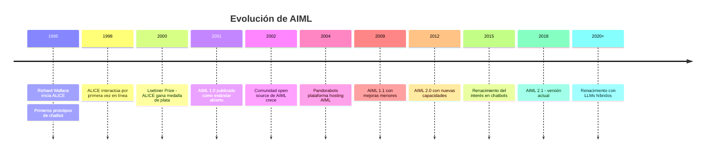

### 1.2 AIML 1.0: La Especificación Original (2001)

La versión 1.0 estableció los fundamentos:

- **Category**: Unidad básica de conocimiento
- **Pattern**: Patrón de coincidencia con entrada del usuario
- **Template**: Respuesta al patrón coincidente
- **Wildcard `*`**: Coincidencia de una o más palabras
- **Wildcard `_`**: Coincidencia con mayor prioridad
- **`<srai>`**: Reducción simbólica
- **`<random>`**: Respuestas aleatorias
- **`<condition>`**: Respuestas condicionales
- **`<set>` y `<get>`**: Variables

### 1.3 AIML 1.1: Primeras Mejoras (2009)

Mejoras incrementales:
- Soporte mejorado para múltiples idiomas
- Correcciones de ambigüedad en el estándar
- Mejoras en el manejo de `<that>` y `<topic>`

### 1.4 AIML 2.0: Nuevas Capacidades (2012)

AIML 2.0 introdujo elementos revolucionarios:

| Elemento | Descripción |
|----------|-------------|
| `<thinking>` | Razonamiento interno del bot |
| `<learn>` y `<learnf>` | Aprendizaje dinámico durante conversación |
| `<unlearn>` | Capacidad de olvidar aprendizaje |
| `**` (Double Star) | Wildcard que coincide cero o más palabras |
| `^` (Caret) | Wildcard que coincide cero o una palabra |
| `<date>` | Acceso a fecha y hora actual |
| `<eval>` | Ejecución de comandos del sistema |
| `<system>` | Operaciones de nivel sistema |
| `<first>`, `<rest>`, `<size>` | Manejo de listas |
| `<request>`, `<response>` | Acceso al historial de conversación |

### 1.5 AIML 2.1: Versión Actual (2018)

La versión 2.1 es una refinación de AIML 2.0:
- Corrección de ambiguidades
- Mejoras en la especificación de `<condition>`
- Estandarización del manejo de wildcards
- Soporte mejorado para Unicode

### 1.6 El Loebner Prize y la Competencia de Chatbots

El **Loebner Prize** es una competencia anual donde chatbots compiten en conversaciones. ALICE ganó medallas de plata en 2000, 2001 y 2004, demostrando que AIML podía competir con sistemas más complejos.

### 1.7 AIML en la Era de los LLMs: Relevancia Actual

Con la llegada de modelos como GPT y Claude, podría parecer que AIML quedó obsoleto. Sin embargo, AIML sigue siendo relevante por:

1. **Control predictivo**: AIML garantiza respuestas específicas, a diferencia de LLMs
2. **Sin necesidad de GPU**: Funciona en hardware básico
3. **Privacidad**: No requiere envío de datos a servicios externos
4. **Personalización**: Fácil de personalizar para dominios específicos
5. **Hibridación**: AIML puede actuar como capa de control para LLMs

### 1.8 Comparación con Otros Formatos

| Formato | Ventajas | Desventajas |
|---------|----------|-------------|
| **AIML** | Estándar abierto, gran comunidad, maduro | Verboso, limitado para NLU complejo |
| **RiveScript** | Sintaxis más simple, multi-lenguaje | Menos features que AIML 2.0 |
| **ChatScript** | Potente para conversaciones, eficiente | Curva de aprendizaje alta |
| **BotML** | Nuevo, integrado con ML | Poca comunidad |
| **LLMs** | Natural, flexible | No predecible, costoso, requiere datos |

---

## Capítulo 2: Arquitectura de un Procesador AIML


### 2.1 Flujo General de Procesamiento

Un procesador AIML (también llamado "motor AIML") es el software que interpreta y ejecuta archivos AIML. Comprender su arquitectura es fundamental para escribir AIML efectivo.

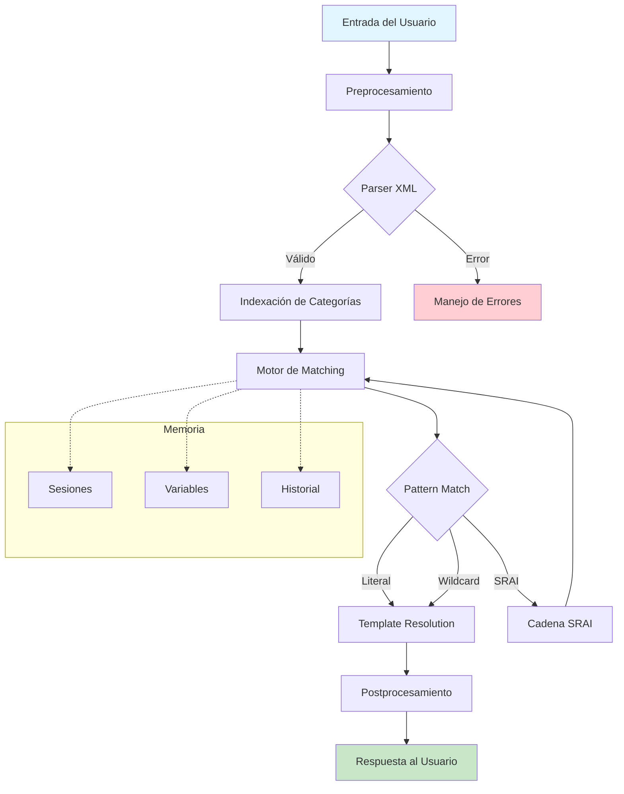

### 2.2 Parser XML y Validación

El primer paso es validar que el AIML sea XML válido:

```xml
<?xml version="1.0" encoding="UTF-8"?>
<aiml version="2.0">
  <category>
    <pattern>HOLA</pattern>
    <template>¡Hola!</template>
  </category>
</aiml>
```

**Reglas de validación:**
- Debe tener un elemento raíz `<aiml>`
- Todos los elementos deben estar correctamente cerrados
- Los atributos deben estar entre comillas
- El encoding debe ser UTF-8 o ISO-8859-1

### 2.3 Indexación de Categorías

Una vez parseado, el procesador indexa las categorías para búsqueda eficiente:

```
Índice de Patrones:
├── LITERALES (mayor prioridad)
│   ├── "HOLA" → category[0]
│   ├── "ADIOS" → category[1]
│   └── "QUE HORA ES" → category[2]
├── UNDERSCORE (prioridad media)
│   ├── "_ ES TU NOMBRE" → category[5]
│   └── "_ TE GUSTA" → category[6]
└── STAR (menor prioridad)
    ├── "QUE ES *" → category[10]
    └── "CUENTAME *" → category[11]
```

### 2.4 Motor de Matching de Patrones

El motor de matching sigue estas reglas:

1. **Literal primero**: Busca coincidencia exacta
2. **Underscore**: Busca `_` antes que `*`
3. **Longitud**: Patrones más largos tienen prioridad
4. **`<that>`**: Si hay `<that>`, verifica también el contexto

### 2.5 Resolución de Templates

Cuando un patrón coincide, se resuelve el template:

```xml
<template>
  <thinking>
    El usuario pregunta por mi nombre.
    Debo responder con mi nombre configurado.
  </thinking>
  Mi nombre es <bot name="name"/>.
</template>
```

**Orden de resolución:**
1. Variables `<set>` y `<get>`
2. Propiedades `<bot>`
3. Wildcards `<star>`
4. Condiciones `<condition>`
5. Transformaciones de texto
6. Elementos HTML

### 2.6 Manejo de Sesiones

Cada conversación con un usuario es una **sesión**. Las sesiones almacenan:

- Variables de usuario (`<set name="user-x">`)
- Historial de conversación (`<that>`)
- Tema actual (`<topic>`)
- Variables de aprendizaje (`<learn>`)

### 2.7 Memoria y Persistencia

| Tipo de Memoria | Alcance | Persistencia |
|-----------------|---------|--------------|
| Variables `user-*` | Global de sesión | Temporal |
| Variables `bot-*` | Global | Permanente |
| Variables `topic-*` | Por tema | Temporal |
| Aprendizaje `<learn>` | Global de sesión | Temporal |
| Aprendizaje `<learnf>` | Global | Permanente |

---

## Capítulo 3: Estructura Básica de AIML


### 3.1 El Elemento Raíz `<aiml>`

Todo archivo AIML comienza con el elemento raíz:

```xml
<?xml version="1.0" encoding="UTF-8"?>
<aiml version="2.0">
  <!-- Contenido AIML aquí -->
</aiml>
```

**Atributos de `<aiml>`:**
- `version`: Versión del estándar (1.0, 1.1, 2.0, 2.1)

### 3.2 El Elemento `<category>`

La **category** es la unidad fundamental de conocimiento en AIML. Cada category contiene un patrón y una respuesta:

```xml
<category>
  <pattern>HOLA</pattern>
  <template>¡Hola! ¿Cómo estás?</template>
</category>
```

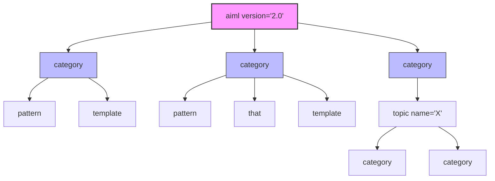

### 3.3 El Elemento `<pattern>`

El patrón define qué entradas del usuario coinciden con esta category:

```xml
<pattern>WHAT IS YOUR NAME</pattern>
```

**Reglas de patrones:**
- **Case-insensitive**: No distinguen mayúsculas/minúsculas
- **Sin puntuación**: Ignoran signos de puntuación
- **Espacios múltiples**: Un solo espacio o múltiples son equivalentes
- **Wildcards**: `*`, `_`, `**`, `^`

**Ejemplos:**
```
"WHAT IS YOUR NAME"  →  coincide con "what is your name"
"WHAT IS YOUR NAME"  →  coincide con "What Is Your Name"
"WHAT IS YOUR NAME"  →  coincide con "WHAT  IS  YOUR  NAME"
```

### 3.4 El Elemento `<template>`

El template define la respuesta cuando el patrón coincide:

```xml
<template>Mi nombre es Alice.</template>
```

Los templates pueden contener:
- Texto plano
- Variables (`<set>`, `<get>`)
- Wildcards capturadas (`<star>`)
- Condiciones (`<condition>`)
- Respuestas aleatorias (`<random>`)
- Transformaciones de texto
- Elementos HTML
- Razonamiento interno (`<thinking>`)

### 3.5 Anidamiento y Jerarquía

AIML permite anidamiento de elementos:

```xml
<aiml version="2.0">
  <topic name="SALUDOS">
    <category>
      <pattern>HOLA</pattern>
      <template>
        <random>
          <li>¡Hola!</li>
          <li>¡Buenos días!</li>
          <li>¡Qué tal!</li>
        </random>
      </template>
    </category>
  </topic>
</aiml>
```

### 3.6 Codificación y Encoding

**Encoding soportado:**
- UTF-8 (recomendado)
- ISO-8859-1 (Latin-1)

**Caracteres especiales en AIML:**
```xml
<!-- Menor que -->
&lt;

<!-- Mayor que -->
&gt;

<!-- Ampersand -->
&amp;

<!-- Comillas dobles -->
&quot;

<!-- Comillas simples -->
&apos;
```

### 3.7 Comentarios en AIML

```xml
<aiml version="2.0">
  <!-- Este es un comentario -->
  
  <category>
    <pattern>HOLA</pattern>
    <template>¡Hola!</template>
  </category>
  
  <!-- 
    Comentario multilinea
    que puede extenderse
    por varias líneas
  -->
</aiml>
```

### 3.8 Estructura de Archivos Múltiples

Un proyecto AIML típico organiza los archivos así:

```
aiml_project/
├── main.aiml              # Archivo principal
├── categories/
│   ├── saludos.aiml       # Categories de saludo
│   ├── despedidas.aiml    # Categories de despedida
│   ├── preguntas.aiml     # Categories de preguntas
│   └── fallback.aiml      # Respuesta por defecto
├── topics/
│   ├── weather.aiml       # Tema: clima
│   └── music.aiml         # Tema: música
└── bootstrap.aiml         # Categories iniciales
```

---

## Capítulo 4: Wildcards - Guía Completa


### 4.1 `*` (Star): Coincide Una o Más Palabras

El wildcard `*` coincide con una o más palabras en la entrada del usuario:

```xml
<category>
  <pattern>QUE ES *</pattern>
  <template>
    <thinking>
      El usuario pregunta sobre algo.
      Debo responder explicando qué es.
    </thinking>
    <star/> es algo interesante sobre lo que puedo hablar.
  </template>
</category>
```

**Ejemplos de coincidencia:**
```
"QUE ES"           →  NO coincide (faltan palabras después de *)
"QUE ES PYTHON"    →  SÍ coincide, <star/> = "PYTHON"
"QUE ES EL CIELO"  →  SÍ coincide, <star/> = "EL CIELO"
```

### 4.2 `_` (Underscore): Coincide con Mayor Prioridad

El wildcard `_` funciona igual que `*` pero tiene **mayor prioridad** en el matching:

```xml
<category>
  <pattern>_ ES TU NOMBRE</pattern>
  <template>Mi nombre es Alice.</template>
</category>

<category>
  <pattern>QUE * ES TU NOMBRE</pattern>
  <template>¿Por qué preguntas por mi nombre?</template>
</category>
```

**Resultado:** `"QUE ES TU NOMBRE"` coincidirá con la primera category (`_`) porque `_` tiene mayor prioridad.

### 4.3 `**` (Double Star): Coincide Cero o Más Palabras (AIML 2.0)

El wildcard `**` coincide con **cero o más palabras**:

```xml
<category>
  <pattern>CUENTAME SOBRE **</pattern>
  <template>
    <thinking>
      El usuario quiere información sobre un tema.
      <star/> contiene el tema completo o está vacío.
    </thinking>
    <star/> es un tema fascinante.
  </template>
</category>
```

**Ejemplos de coincidencia:**
```
"CUENTAME SOBRE"           →  SÍ coincide, <star/> = "" (vacío)
"CUENTAME SOBRE PYTHON"    →  SÍ coincide, <star/> = "PYTHON"
"CUENTAME SOBRE EL CIELO"  →  SÍ coincide, <star/> = "EL CIELO"
```

### 4.4 `^` (Caret): Coincide Cero o Una Palabra (AIML 2.0)

El wildcard `^` coincide con **cero o una palabra**:

```xml
<category>
  <pattern>QUE ^ HORA ES</pattern>
  <template>Es hora de programar.</template>
</category>
```

**Ejemplos de coincidencia:**
```
"QUE HORA ES"         →  SÍ coincide, <star/> = "" (vacío)
"QUE ES HORA ES"      →  SÍ coincide, <star/> = "ES"
"QUE LA HORA ES"      →  NO coincide (más de una palabra)
```

### 4.5 `<star index="N"/>`: Acceso a Coincidencias

Cuando hay múltiples wildcards, `<star index="N"/>` accede a la N-esima coincidencia:

```xml
<category>
  <pattern>MI * ES *</pattern>
  <template>
    Tu <star index="1"/> es <star index="2"/>.
  </template>
</category>
```

**Ejemplo:**
```
Entrada: "MI COLOR ES AZUL"
<star index="1"/> = "COLOR"
<star index="2"/> = "AZUL"
```

### 4.6 Combinación de Wildcards

```xml
<category>
  <pattern>QUE * ES _</pattern>
  <template>
    <star index="1"/> es <star index="2"/>.
  </template>
</category>
```

**Ejemplo:**
```
Entrada: "QUE LENGUAJE ES PYTHON"
<star index="1"/> = "LENGUAJE"
<star index="2"/> = "PYTHON"
```

### 4.7 Errores Comunes con Wildcards

| Error | Problema | Solución |
|-------|----------|----------|
| `QUE * ES *` | Ambigüedad en matching | Usar `index` explícito |
| `* ES` | `*` al final no captura correctamente | Usar `**` al final |
| `_ *` | Combinación rara | Evitar esta combinación |
| `** *` | Conflicto de prioridad | Usar un solo tipo |

### 4.8 Tabla de Prioridad Completa

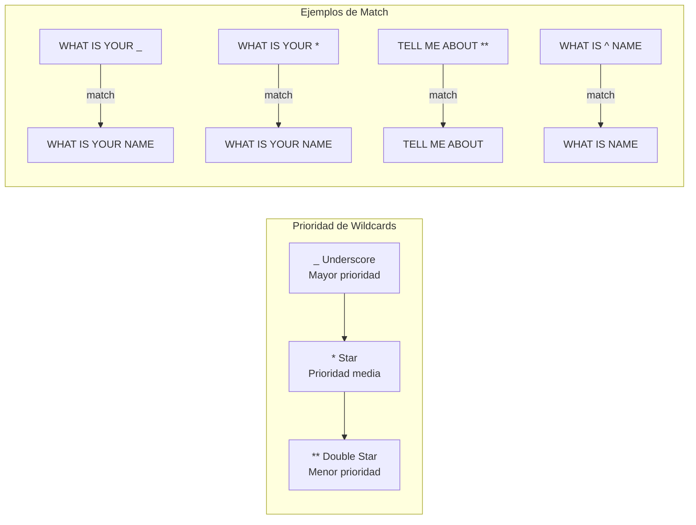

**Reglas de prioridad:**

| Prioridad | Tipo | Descripción |
|-----------|------|-------------|
| 1 (Mayor) | Literal | Sin wildcards |
| 2 | `_` | Underscore |
| 3 | `*` | Star |
| 4 (Menor) | `**` | Double Star |
| 5 | `^` | Caret |

**Longitud del patrón:**
- Patrones más largos tienen mayor prioridad
- `"QUE ES TU *"` tiene prioridad sobre `"QUE *"`

---

# Parte II: Elementos de Control

---

## Capítulo 5: Symbolic Reduction (SRAI)


### 5.1 Concepto de SRAI

**SRAI** (Symbolic Reduction) redirige un patrón a otro. Es la herramienta más poderosa para manejar sinónimos, abreviaciones y normalización de entrada.

```xml
<category>
  <pattern>HOLA</pattern>
  <template>¡Hola! ¿Cómo estás?</template>
</category>

<category>
  <pattern>Buenos dias</pattern>
  <template><srai>HOLA</srai></template>
</category>

<category>
  <pattern>QUE tal</pattern>
  <template><srai>HOLA</srai></template>
</category>
```

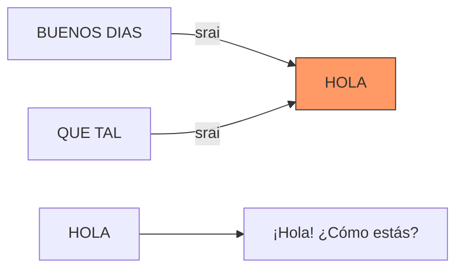

### 5.2 SRAI Básico

```xml
<!-- Sinónimos -->
<category>
  <pattern>QUE HORA ES</pattern>
  <template>Son las tres de la tarde.</template>
</category>

<category>
  <pattern>HORA ACTUAL</pattern>
  <template><srai>QUE HORA ES</srai></template>
</category>

<category>
  <pattern>QUE HORA TENEMOS</pattern>
  <template><srai>QUE HORA ES</srai></template>
</category>

<!-- Abreviaciones -->
<category>
  <pattern>BTW *</pattern>
  <template><srai>BY THE WAY <star/></srai></template>
</category>

<category>
  <pattern>OMG *</pattern>
  <template><srai>OH MY GOD <star/></srai></template>
</category>
```

### 5.3 SRAI con Wildcards

```xml
<category>
  <pattern>QUE ES *</pattern>
  <template>
    <star/> es un concepto interesante.
  </template>
</category>

<!-- Normalización de preguntas -->
<category>
  <pattern>QUE SIGNIFICA *</pattern>
  <template><srai>QUE ES <star/></srai></template>
</category>

<category>
  <pattern>CUAL ES LA DEFINICION DE *</pattern>
  <template><srai>QUE ES <star/></srai></template>
</category>

<category>
  <pattern>DEFINE *</pattern>
  <template><srai>QUE ES <star/></srai></template>
</category>
```

### 5.4 Cadenas SRAI y Recursión

SRAI puede formar cadenas:

```xml
<category>
  <pattern>HOLA</pattern>
  <template>¡Hola!</template>
</category>

<category>
  <pattern>BUENOS DIAS</pattern>
  <template><srai>HOLA</srai></template>
</category>

<category>
  <pattern>QUE TAL</pattern>
  <template><srai>BUENOS DIAS</srai></template>
</category>
```

**Cadena:** `"QUE TAL"` → `"BUENOS DIAS"` → `"HOLA"` → `"¡Hola!"`

### 5.5 Prevención de Loops Infinitos

**PELIGRO:** SRAI puede causar loops infinitos:

```xml
<!-- MAL: Loop infinito -->
<category>
  <pattern>A</pattern>
  <template><srai>B</srai></template>
</category>

<category>
  <pattern>B</pattern>
  <template><srai>A</srai></template>
</category>
```

**Soluciones:**

1. **Límite de iteraciones**: La mayoría de procesadores tienen un límite (típicamente 10-50)
2. **Evitar ciclos**: Nunca crear cadenas circulares
3. **Documentar cadenas**: Mantener un registro de las cadenas SRAI

### 5.6 Patrón de Sinónimos

```xml
<!-- Tema: Colores -->
<category>
  <pattern>ROJO</pattern>
  <template>El rojo es un color cálido.</template>
</category>

<category>
  <pattern>BERMELLON</pattern>
  <template><srai>ROJO</srai></template>
</category>

<category>
  <pattern>ESCARLATA</pattern>
  <template><srai>ROJO</srai></template>
</category>

<category>
  <pattern>CARMESI</pattern>
  <template><srai>ROJO</srai></template>
</category>
```

### 5.7 Patrón de Abreviaciones

```xml
<category>
  <pattern>ESTADOS UNIDOS DE AMERICA</pattern>
  <template>Estados Unidos es un país de América del Norte.</template>
</category>

<category>
  <pattern>EEUU</pattern>
  <template><srai>ESTADOS UNIDOS DE AMERICA</srai></template>
</category>

<category>
  <pattern>EE.UU.</pattern>
  <template><srai>ESTADOS UNIDOS DE AMERICA</srai></template>
</category>

<category>
  <pattern>USA</pattern>
  <template><srai>ESTADOS UNIDOS DE AMERICA</srai></template>
</category>
```

### 5.8 Patrón de Normalización

```xml
<!-- Normalización de entrada -->
<category>
  <pattern>quisiera *</pattern>
  <template><srai>QUIERO <star/></srai></template>
</category>

<category>
  <pattern>me gustaria *</pattern>
  <template><srai>QUIERO <star/></srai></template>
</category>

<category>
  <pattern>necesito *</pattern>
  <template><srai>QUIERO <star/></srai></template>
</category>

<category>
  <pattern>QUERO *</pattern>
  <template><srai>QUIERO <star/></srai></template>
</category>

<!-- Respuesta unificada -->
<category>
  <pattern>QUIERO *</pattern>
  <template>
    Entiendo que quieres <star/>.
  </template>
</category>
```

---

## Capítulo 6: Condiciones


### 6.1 Condición Básica

Las condiciones permiten respuestas diferentes según variables:

```xml
<category>
  <pattern>COMO ESTAS</pattern>
  <template>
    <condition name="user-mood">
      <li value="happy">¡Estoy genial!</li>
      <li value="sad">Estoy un poco triste.</li>
      <li value="angry">Estoy tranquilo.</li>
      <li>Estoy bien, gracias por preguntar.</li>
    </condition>
  </template>
</category>
```

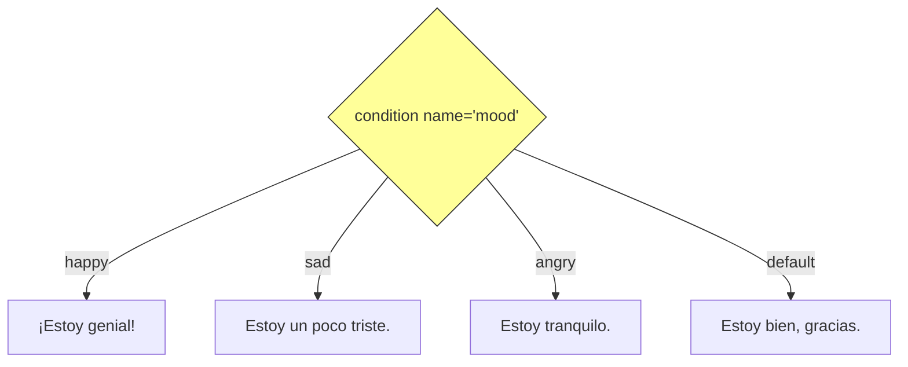

### 6.2 Condición con Value

```xml
<category>
  <pattern>MI NOMBRE ES *</pattern>
  <template>
    <set name="user-name"><star/></set>
    Mucho gusto, <get name="user-name"/>!
  </template>
</category>

<category>
  <pattern>QUE SABES DE MI</pattern>
  <template>
    <condition name="user-name">
      <li value="">No sé tu nombre todavía.</li>
      <li>Tu nombre es <get name="user-name"/>.</li>
    </condition>
  </template>
</category>
```

### 6.3 Condición con `var` (AIML 2.0)

AIML 2.0 introduce `var` como alias de `name`:

```xml
<category>
  <pattern>COMO ME LLAMO</pattern>
  <template>
    <condition var="user-name">
      <li value="">No sé tu nombre.</li>
      <li>Te llamas <get var="user-name"/>.</li>
    </condition>
  </template>
</category>
```

### 6.4 Condición Anidada

```xml
<category>
  <pattern>MOSTRAR PERFIL</pattern>
  <template>
    <condition name="logged-in">
      <li value="true">
        <condition name="user-role">
          <li value="admin">Perfil de Administrador</li>
          <li value="user">Perfil de Usuario</li>
          <li>Perfil Básico</li>
        </condition>
      </li>
      <li>Debes iniciar sesión primero.</li>
    </condition>
  </template>
</category>
```

### 6.5 Condición con Múltiples `<li>`

```xml
<category>
  <pattern>COMO ESTA EL CLIMA</pattern>
  <template>
    <condition name="weather">
      <li value="sunny">Hace sol y está hermoso.</li>
      <li value="rainy">Está lloviendo, lleva paraguas.</li>
      <li value="cloudy">Está nublado.</li>
      <li value="snowy">Está nevando, abrígate bien.</li>
      <li>No tengo información del clima.</li>
    </condition>
  </template>
</category>
```

### 6.6 Patrón de Menú

```xml
<category>
  <pattern>OPCIONES</pattern>
  <template>
    <condition name="menu">
      <li value="main">
        1. Información\n
        2. Soporte\n
        3. Ventas\n
        Escribe un número.
      </li>
      <li value="info">
        1. Empresa\n
        2. Productos\n
        3. Precios\n
        Escribe un número.
      </li>
      <li>
        1. Información\n
        2. Soporte\n
        3. Ventas\n
        Escribe un número.
      </li>
    </condition>
  </template>
</category>
```

### 6.7 Patrón de Estado

```xml
<category>
  <pattern>SIGUIENTE</pattern>
  <template>
    <condition name="step">
      <li value="1">
        <set name="step">2</set>
        Paso 2: Describe tu problema.
      </li>
      <li value="2">
        <set name="step">3</set>
        Paso 3: Elige una categoría.
      </li>
      <li value="3">
        <set name="step">1</set>
        Tu caso ha sido registrado.
      </li>
      <li>
        <set name="step">1</set>
        Paso 1: Dime tu nombre.
      </li>
    </condition>
  </template>
</category>
```

---

## Capítulo 7: Respuestas Aleatorias


### 7.1 Básico `<random>` con `<li>`

```xml
<category>
  <pattern>HOLA</pattern>
  <template>
    <random>
      <li>¡Hola!</li>
      <li>¡Buenos días!</li>
      <li>¡Qué tal!</li>
      <li>¡Hey!</li>
      <li>¡Bienvenido!</li>
    </random>
  </template>
</category>
```

### 7.2 Random con SRAI

```xml
<category>
  <pattern>HOLA</pattern>
  <template>
    <random>
      <li>¡Hola!</li>
      <li>¡Buenos días!</li>
    </random>
  </template>
</category>

<category>
  <pattern>QUE TAL</pattern>
  <template><srai>HOLA</srai></template>
</category>

<category>
  <pattern>Buenos dias</pattern>
  <template><srai>HOLA</srai></template>
</category>
```

### 7.3 Random con Condiciones

```xml
<category>
  <pattern>HOLA *</pattern>
  <template>
    <condition name="user-name">
      <li value="">
        <random>
          <li>¡Hola! ¿Cómo te llamas?</li>
          <li>¡Hola! No sé tu nombre.</li>
        </random>
      </li>
      <li>
        <random>
          <li>¡Hola, <get name="user-name"/>!</li>
          <li>¡Qué tal, <get name="user-name"/>!</li>
          <li>¡Buenos días, <get name="user-name"/>!</li>
        </random>
      </li>
    </condition>
  </template>
</category>
```

### 7.4 Patrón de Personalidad

```xml
<category>
  <pattern>GRACIAS</pattern>
  <template>
    <condition name="personality">
      <li value="formal">
        <random>
          <li>Es un placer haberle ayudado.</li>
          <li>Muchas gracias a usted.</li>
        </random>
      </li>
      <li value="casual">
        <random>
          <li>¡No hay de qué!</li>
          <li>¡De nada, bro!</li>
          <li>¡Tranqui!</li>
        </random>
      </li>
      <li>
        <random>
          <li>¡De nada!</li>
          <li>¡Con gusto!</li>
          <li>No hay problema.</li>
        </random>
      </li>
    </condition>
  </template>
</category>
```

### 7.5 Patrón de Variación

```xml
<category>
  <pattern>CUENTAME ALGO</pattern>
  <template>
    <random>
      <li>¿Sabías que el agua cubre el 71% de la Tierra?</li>
      <li>¿Sabías que los pulpos tienen tres corazones?</li>
      <li>¿Sabías que la luz viaja a 299,792 km/s?</li>
      <li>¿Sabías que las abejas pueden reconocer rostros humanos?</li>
    </random>
  </template>
</category>
```

---

## Capítulo 8: Manejo de Contexto


### 8.1 Concepto de `<that>`

El elemento `<that>` permite responder según la **respuesta anterior del bot**. Esto crea contexto conversacional.

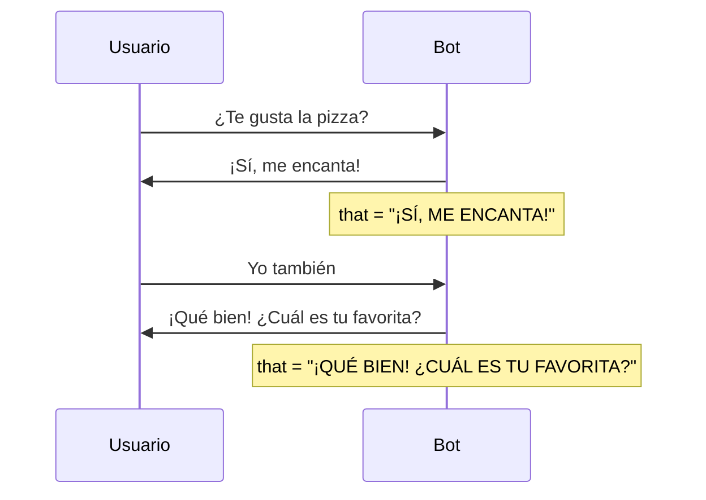

### 8.2 `<that>` Básico

```xml
<category>
  <pattern>¿TE GUSTA LA PIZZA?</pattern>
  <template>¡Sí, me encanta!</template>
</category>

<category>
  <pattern>YO TAMBIÉN</pattern>
  <that>¡SÍ, ME ENCANTA!</that>
  <template>¡Qué bien! ¿Cuál es tu favorita?</template>
</category>

<category>
  <pattern>YO TAMBIÉN</pattern>
  <that>NO ME GUSTA NADA</that>
  <template>¿En serio? ¡Es deliciosa!</template>
</category>
```

### 8.3 `<that>` con Wildcards

```xml
<category>
  <pattern>CUÁL ES TU *</pattern>
  <template>
    Mi <star/> favorito es la programación.
  </template>
</category>

<category>
  <pattern>¿POR QUÉ?</pattern>
  <that>MI * FAVORITO ES *</that>
  <template>
    Porque es algo que me apasiona.
  </template>
</category>
```

### 8.4 Múltiples Niveles de `<that>`

Puedes especificar múltiples respuestas anteriores separadas por barras:

```xml
<category>
  <pattern>SÍ</pattern>
  <that>¿QUIERES MÁS? / BIEN</that>
  <template>¡Genial!</template>
</category>
```

### 8.5 Patrón de Conversación Guiada

```xml
<category>
  <pattern>COMPRAR</pattern>
  <template>
    ¿Qué te gustaría comprar?
  </template>
</category>

<category>
  <pattern>UNA CAMISETA</pattern>
  <that>¿QUÉ TE GUSTARÍA COMPRAR?</that>
  <template>
    Tenemos tallas S, M, L y XL. ¿Cuál necesitas?
  </template>
</category>

<category>
  <pattern>MEDIANA</pattern>
  <that>¿CUÁL NECESITAS?</that>
  <template>
    Perfecto, camiseta talla M. ¿De qué color?
  </template>
</category>

<category>
  <pattern>AZUL</pattern>
  <that>¿DE QUÉ COLOR?</that>
  <template>
    Excelente elección. Camiseta talla M en azul.
    ¿Quieres proceder al pago?
  </template>
</category>
```

### 8.6 Patrón de Confirmación

```xml
<category>
  <pattern>ELIMINAR CUENTA</pattern>
  <template>
    ¿Estás seguro de que quieres eliminar tu cuenta?
    Esta acción no se puede deshacer.
  </template>
</category>

<category>
  <pattern>SÍ</pattern>
  <that>¿ESTÁS SEGURO DE QUE QUIERES ELIMINAR TU CUENTA?</that>
  <template>
    Tu cuenta ha sido eliminada. Lamento verte partir.
  </template>
</category>

<category>
  <pattern>NO</pattern>
  <that>¿ESTÁS SEGURO DE QUE QUIERES ELIMINAR TU CUENTA?</that>
  <template>
    ¡Bien! Tu cuenta está a salvo.
  </template>
</category>
```

---

## Capítulo 9: Sistema de Temas


### 9.1 Concepto de Topic

Los temas (`<topic>`) agrupan categories relacionadas. Esto ayuda a organizar el conocimiento y a manejar el contexto.

```xml
<topic name="WEATHER">
  <category>
    <pattern>¿CÓMO ESTÁ EL CLIMA?</pattern>
    <template>El clima está soleado hoy.</template>
  </category>
  
  <category>
    <pattern>VA A LLOVER</pattern>
    <template>No, el pronóstico dice sol.</template>
  </category>
</topic>

<topic name="SPORTS">
  <category>
    <pattern>¿QUIÉN GANÓ?</pattern>
    <template>El equipo local ganó 3-1.</template>
  </category>
</topic>
```

### 9.2 Topic Básico

```xml
<aiml version="2.0">
  <!-- Topic global (sin topic) -->
  <category>
    <pattern>HOLA</pattern>
    <template>¡Hola!</template>
  </category>
  
  <!-- Topic: Cocina -->
  <topic name="COCINA">
    <category>
      <pattern>¿QUÉ COCINAMOS?</pattern>
      <template>Podemos hacer pasta o ensalada.</template>
    </category>
    
    <category>
      <pattern>RECETA DE *</pattern>
      <template>No tengo esa receta, pero puedo buscar.</template>
    </category>
  </topic>
  
  <!-- Topic: Tecnología -->
  <topic name="TECNOLOGIA">
    <category>
      <pattern>¿QUÉ ES PYTHON?</pattern>
      <template>Python es un lenguaje de programación.</template>
    </category>
  </topic>
</aiml>
```

### 9.3 Topic con Wildcards

```xml
<topic name="*_TUTORIAL">
  <category>
    <pattern>EXPLICAME *</pattern>
    <template>
      Te voy a explicar sobre <star/>.
    </template>
  </category>
</topic>
```

### 9.4 Cambio de Topic

```xml
<category>
  <pattern>CAMBIEMOS DE TEMA</pattern>
  <template>
    <set name="topic">GENERAL</set>
    ¿De qué quieres hablar?
  </template>
</category>

<category>
  <pattern>HABLEMOS DE COCINA</pattern>
  <template>
    <set name="topic">COCINA</set>
    ¡Genial! ¿Qué te gustaría saber de cocina?
  </template>
</category>

<category>
  <pattern>HABLEMOS DE DEPORTES</pattern>
  <template>
    <set name="topic">DEPORTES</set>
    ¡Perfecto! ¿Qué deporte te interesa?
  </template>
</category>
```

### 9.5 Patrón de Navegación por Temas

```xml
<category>
  <pattern>MENÚ PRINCIPAL</pattern>
  <template>
    <set name="topic">GENERAL</set>
    1. Tecnología
    2. Ciencia
    3. Deportes
    4. Cocina
    Elige un tema.
  </template>
</category>

<category>
  <pattern>UNO</pattern>
  <that>ELIGE UN TEMA</that>
  <template>
    <set name="topic">TECNOLOGIA</set>
    Bienvenido al tema de tecnología.
    ¿Qué te gustaría saber?
  </template>
</category>
```

### 9.6 Patrón de Contexto Temático

```xml
<topic name="TECNOLOGIA">
  <category>
    <pattern>CUÉNTAME MÁS</pattern>
    <template>
      En el ámbito tecnológico, hay mucho por explorar.
      ¿Qué área te interesa?
    </template>
  </category>
  
  <category>
    <pattern> *</pattern>
    <template>
      En tecnología podemos hablar de:
      programación, hardware, inteligencia artificial, etc.
    </template>
  </category>
</topic>
```

---

# Parte III: Variables y Estado

---

## Capítulo 10: Variables y Alcance


### 10.1 Variables de Usuario

Las variables de usuario (`user-*`) almacenan información específica del usuario:

```xml
<category>
  <pattern>MI NOMBRE ES *</pattern>
  <template>
    <set name="user-name"><star/></set>
    Mucho gusto, <get name="user-name"/>!
  </template>
</category>

<category>
  <pattern>TENGO * AÑOS</pattern>
  <template>
    <set name="user-age"><star/></set>
    ¡Tienes <star/> años! Eso es genial.
  </template>
</category>

<category>
  <pattern>ME LLAMO *</pattern>
  <template><srai>MI NOMBRE ES <star/></srai></template>
</category>
```

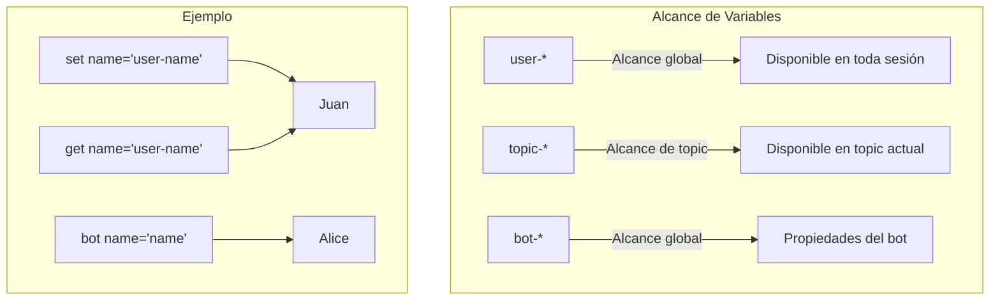

### 10.2 Variables de Bot

Las variables de bot (`bot-*`) definen propiedades del asistente:

```xml
<category>
  <pattern>¿QUIÉN ERES?</pattern>
  <template>
    Soy <bot name="name"/>, versión <bot name="version"/>.
  </template>
</category>

<category>
  <pattern>¿CÓMO TE LLAMAS?</pattern>
  <template>
    Mi nombre es <bot name="name"/>.
  </template>
</category>
```

### 10.3 Variables de Topic

Las variables de topic (`topic-*`) son específicas del tema actual:

```xml
<category>
  <pattern>CAMBIAR IDIOMA A ESPAÑOL</pattern>
  <template>
    <set name="topic-language">ES</set>
    Ahora hablo en español.
  </template>
</category>

<category>
  <pattern>CAMBIAR IDIOMA A INGLÉS</pattern>
  <template>
    <set name="topic-language">EN</set>
    Now I speak English.
  </template>
</category>
```

### 10.4 Alcance y Precedencia

Cuando se busca una variable, el orden de búsqueda es:

1. **Variables de topic** (más específica)
2. **Variables de usuario** (sesión)
3. **Variables de bot** (globales)

```xml
<category>
  <pattern>¿CUÁL ES MI COLOR FAVORITO?</pattern>
  <template>
    <condition name="user-color">
      <li value="">No sé tu color favorito aún.</li>
      <li>Tu color favorito es <get name="user-color"/>.</li>
    </condition>
  </template>
</category>

<category>
  <pattern>MI COLOR FAVORITO ES *</pattern>
  <template>
    <set name="user-color"><star/></set>
    ¡Genial! Tu color favorito es <star/>.
  </template>
</category>
```

### 10.5 Patrón de Memoria

```xml
<category>
  <pattern>MI COMIDA FAVORITA ES *</pattern>
  <template>
    <set name="user-food"><star/></set>
    ¡<star/> es deliciosa! Anotado.
  </template>
</category>

<category>
  <pattern>¿CUÁL ES MI COMIDA FAVORITA?</pattern>
  <template>
    <condition name="user-food">
      <li value="">No recuerdo cuál es tu comida favorita.</li>
      <li>Tu comida favorita es <get name="user-food"/>.</li>
    </condition>
  </template>
</category>
```

### 10.6 Patrón de Preferencias

```xml
<category>
  <pattern>CONFIGURAR TEMA OSCURO</pattern>
  <template>
    <set name="theme">dark</set>
    Tema oscuro activado.
  </template>
</category>

<category>
  <pattern>CONFIGURAR TEMA CLARO</pattern>
  <template>
    <set name="theme">light</set>
    Tema claro activado.
  </template>
</category>

<category>
  <pattern>¿CUÁL ES MI TEMA?</pattern>
  <template>
    <condition name="theme">
      <li value="dark">Estás usando el tema oscuro.</li>
      <li value="light">Estás usando el tema claro.</li>
      <li>No tienes un tema configurado.</li>
    </condition>
  </template>
</category>
```

---

## Capítulo 11: Elementos de Lista


### 11.1 `<list>` - Crear Listas

```xml
<category>
  <pattern>LISTA DE COMPRAS</pattern>
  <template>
    <list>
      <li>Leche</li>
      <li>Pan</li>
      <li>Huevos</li>
      <li>Queso</li>
    </list>
  </template>
</category>
```

### 11.2 `<first>` - Primer Elemento

```xml
<category>
  <pattern>PRIMER ELEMENTO DE *</pattern>
  <template>
    El primer elemento es: <first><star/></first>
  </template>
</category>
```

### 11.3 `<rest>` - Resto de la Lista

```xml
<category>
  <pattern>RESTO DE *</pattern>
  <template>
    El resto de la lista es: <rest><star/></rest>
  </template>
</category>
```

### 11.4 `<size>` - Tamaño de la Lista

```xml
<category>
  <pattern>CUÁNTOS ELEMENTOS TIENE *</pattern>
  <template>
    La lista tiene <size><star/></size> elementos.
  </template>
</category>
```

### 11.5 `<repeat>` - Repetir Contenido

```xml
<category>
  <pattern>REPETIR * 3 VECES</pattern>
  <template>
    <repeat count="3"><star/></repeat>
  </template>
</category>
```

### 11.6 `<loop>` - Iterar sobre Listas

```xml
<category>
  <pattern>IMPRIMIR LISTA</pattern>
  <template>
    <loop>
      <li><get name="current-item"/></li>
    </loop>
  </template>
</category>
```

### 11.7 Patrón de Iteración

```xml
<category>
  <pattern>CONTAR DEL 1 AL *</pattern>
  <template>
    <repeat count="<star/>">
      <get name="loop-count"/> 
    </repeat>
  </template>
</category>
```

---

## Capítulo 12: Historial de Conversación

![Línea de tiempo de historial de conversación mostrando: input[1], input[2], input[3] con marcas de tiempo y contenido, estilo timeline visual](images/12_historial_conversacion.png)

### 12.1 `<input>` - Historial de Input

```xml
<category>
  <pattern>QUÉ DIJE ANTES</pattern>
  <template>
    Anteriormente dijiste: <input index="1"/>
  </template>
</category>

<category>
  <pattern>QUÉ DIJE HACE 2 TURNOS</pattern>
  <template>
    Hace dos turnos dijiste: <input index="2"/>
  </template>
</category>
```

### 12.2 `<request>` - Peticiones del Usuario

```xml
<category>
  <pattern>HISTORIAL</pattern>
  <template>
    Tus últimas peticiones fueron:
    1. <request index="1"/>
    2. <request index="2"/>
    3. <request index="3"/>
  </template>
</category>
```

### 12.3 `<response>` - Respuestas del Bot

```xml
<category>
  <pattern>QUÉ RESPONDISTE</pattern>
  <template>
    Mi última respuesta fue: <response index="1"/>
  </template>
</category>
```

### 12.4 Patrón de Memoria a Largo Plazo

```xml
<category>
  <pattern>CUÉNTAME SOBRE *</pattern>
  <template>
    <thinking>
      El usuario quiere información sobre un tema.
      Debo recordar que le interesó este tema.
    </thinking>
    <set name="last-topic"><star/></set>
    <star/> es un tema fascinante.
  </template>
</category>

<category>
  <pattern>HABLA MÁS SOBRE ESO</pattern>
  <template>
    <condition name="last-topic">
      <li value="">¿Sobre qué tema quieres que hable?</li>
      <li>¿Qué más quieres saber sobre <get name="last-topic"/>?</li>
    </condition>
  </template>
</category>
```

### 12.5 Patrón de Contexto Conversacional

```xml
<category>
  <pattern>NO ME GUSTA *</pattern>
  <template>
    <set name="disliked"><star/></set>
    Entendido, no te gusta <star/>.
  </template>
</category>

<category>
  <pattern>ME GUSTA *</pattern>
  <template>
    <set name="liked"><star/></set>
    ¡Genial! Te gusta <star/>.
  </template>
</category>

<category>
  <pattern>RECOMIENDAME ALGO</pattern>
  <template>
    <thinking>
      Debo recomendar algo que no sea lo que le disgusta.
    </thinking>
    <condition name="disliked">
      <li value="">¿Qué tipo de cosa buscas?</li>
      <li>
        Te recomiendo algo diferente a <get name="disliked"/>.
      </li>
    </condition>
  </template>
</category>
```

---

# Parte IV: Elementos Avanzados

---

## Capítulo 13: Aprendizaje Dinámico


### 13.1 `<learn>` - Aprender durante Conversación

El elemento `<learn>` permite al bot aprender nuevos patrones durante la conversación:

```xml
<category>
  <pattern>APRENDER QUE * ES *</pattern>
  <template>
    <thinking>
      El usuario quiere que aprenda una definición.
      Debo crear una nueva category con esa definición.
    </thinking>
    <learn>
      <category>
        <pattern><star index="1"/></pattern>
        <template><star index="2"/></template>
      </category>
    </learn>
    Aprendí que <star index="1"/> es <star index="2"/>.
  </template>
</category>
```

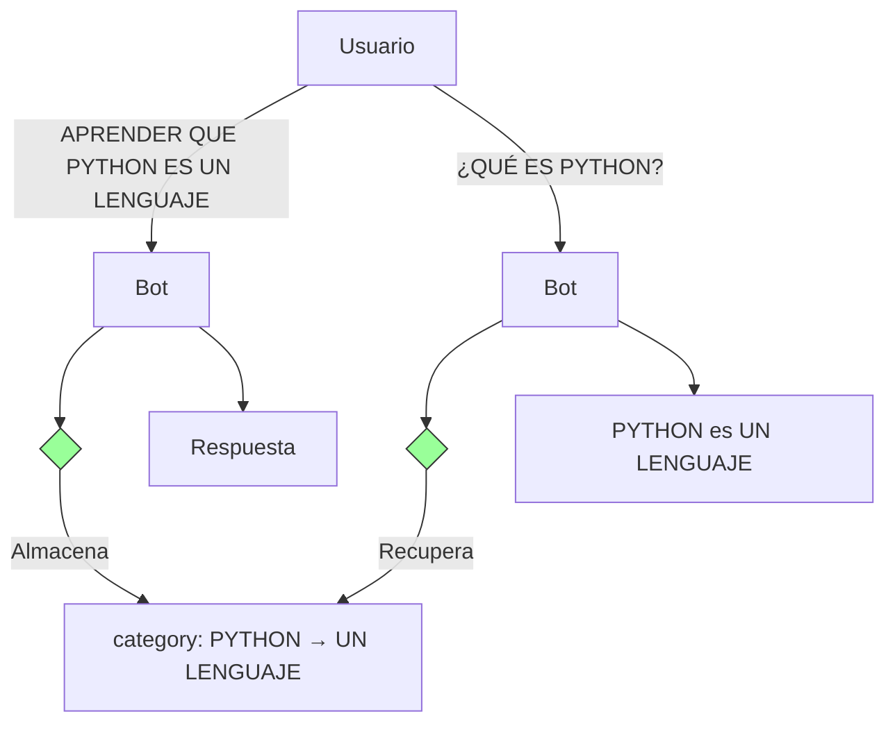

### 13.2 `<learnf>` - Aprender y Persistir

`<learnf>` es como `<learn>` pero el aprendizaje se **persiste** en disco:

```xml
<category>
  <pattern>MI COLOR FAVORITO ES *</pattern>
  <template>
    <learnf>
      <category>
        <pattern>¿CUÁL ES MI COLOR FAVORITO?</pattern>
        <template>Tu color favorito es <star/>.</template>
      </category>
    </learnf>
    ¡Anotado! Tu color favorito es <star/>.
  </template>
</category>
```

### 13.3 `<unlearn>` - Olvidar Aprendizaje

`<unlearn>` elimina un patrón aprendido:

```xml
<category>
  <pattern>OLVIDAR QUE * ES *</pattern>
  <template>
    <unlearn>
      <category>
        <pattern><star index="1"/></pattern>
        <template><star index="2"/></template>
      </category>
    </unlearn>
    Olvidé que <star index="1"/> era <star index="2"/>.
  </template>
</category>
```

### 13.4 Patrón de Auto-Mejora

```xml
<category>
  <pattern>APRENDER SALUDO *</pattern>
  <template>
    <learn>
      <category>
        <pattern><star/></pattern>
        <template>
          <random>
            <li>¡Hola!</li>
            <li>¡Buenos días!</li>
            <li>¡Qué tal!</li>
          </random>
        </template>
      </category>
    </learn>
    Aprendí a saludar con "<star/>".
  </template>
</category>
```

### 13.5 Patrón de Personalización

```xml
<category>
  <pattern>PREFIERO QUE ME LLAMES *</pattern>
  <template>
    <learnf>
      <category>
        <pattern>¿CÓMO ME LLAMO?</pattern>
        <template>Te llamas <star/>.</template>
      </category>
    </learnf>
    ¡Entendido! Te llamaré <star/>.
  </template>
</category>
```

### 13.6 Seguridad y Límites

**Precauciones con `<learn>` y `<learnf>`:**

1. **Validar entrada**: Nunca aprender sin validar
2. **Límites de aprendizaje**: Establecer un máximo de categories aprendidas
3. **Persistencia**: `<learnf>` escribe en disco, usar con cuidado
4. **Seguridad**: Evitar que usuarios aprendan patrones maliciosos

```xml
<category>
  <pattern>APRENDER QUE * ES *</pattern>
  <template>
    <thinking>
      Validar que la entrada no contenga código malicioso.
    </thinking>
    <condition name="learn-count">
      <li value="100">
        Ya he aprendido demasiado. No puedo aprender más.
      </li>
      <li>
        <set name="learn-count">
          <eval>$(learn-count) + 1</eval>
        </set>
        <learn>
          <category>
            <pattern><star index="1"/></pattern>
            <template><star index="2"/></template>
          </category>
        </learn>
        Aprendí que <star index="1"/> es <star index="2"/>.
      </li>
    </condition>
  </template>
</category>
```

---

## Capítulo 14: Transformaciones de Texto


### 14.1 `<person>` - Conversión Primera/Segunda Persona

```xml
<category>
  <pattern>YO DIJE QUE *</pattern>
  <template>
    <person>Tú dijiste que <star/>.</person>
  </template>
</category>
```

**Conversiones:**
- `YO` → `TÚ`
- `MI` → `TU`
- `MÍ` → `TI`
- `ME` → `TE`
- `SOY` → `ERES`

### 14.2 `<person2>` - Conversión Segunda/Tercera Persona

```xml
<category>
  <pattern>ÉL DIJO QUE *</pattern>
  <template>
    <person2>Él dijo que <star/>.</person2>
  </template>
</category>
```

### 14.3 `<gender>` - Intercambio de Género

```xml
<category>
  <pattern>CAMBIAR GÉNERO DE *</pattern>
  <template>
    <gender><star/></gender>
  </template>
</category>
```

**Conversiones:**
- `ÉL` → `ELLA`
- `SUS` → `SUS` (sin cambio)
- `HIM` → `HER`
- `HE` → `SHE`

### 14.4 `<formal>` - Capitalizar Cada Palabra

```xml
<category>
  <pattern>FORMAL *</pattern>
  <template>
    <formal><star/></formal>
  </template>
</category>
```

**Resultado:** `"hola mundo"` → `"Hola Mundo"`

### 14.5 `<uppercase>` y `<lowercase>`

```xml
<category>
  <pattern>MAYÚSCULAS *</pattern>
  <template><uppercase><star/></uppercase></template>
</category>

<category>
  <pattern>MINÚSCULAS *</pattern>
  <template><lowercase><star/></lowercase></template>
</category>
```

### 14.6 `<sentence>` - Capitalizar Primera Letra

```xml
<category>
  <pattern>ORACIÓN *</pattern>
  <template><sentence><star/></sentence></template>
</category>
```

**Resultado:** `"hola mundo"` → `"Hola mundo"`

### 14.7 `<word>` - Conversión Número a Palabra

```xml
<category>
  <pattern>ESCRIBIR * EN LETRAS</pattern>
  <template><word><star/></word></template>
</category>
```

**Resultado:** `"3"` → `"three"`

### 14.8 `<explode>` e `<implode>`

```xml
<category>
  <pattern>EXPLODIR *</pattern>
  <template><explode><star/></explode></template>
</category>

<category>
  <pattern>UNIR *</pattern>
  <template><implode><star/></implode></template>
</category>
```

**Resultado:**
- `<explode>hola</explode>` → `"h o l a"`
- `<implode>h o l a</implode>` → `"hola"`

### 14.9 Patrón de Normalización de Texto

```xml
<category>
  <pattern>NORMALIZAR *</pattern>
  <template>
    <sentence>
      <lowercase><star/></lowercase>
    </sentence>
  </template>
</category>
```

**Resultado:** `"HOLA MUNDO"` → `"Hola mundo"`

---

## Capítulo 15: Operaciones del Sistema


### 15.1 `<thinking>` - Razonamiento Interno

El elemento `<thinking>` permite al bot "pensar" sin mostrar ese razonamiento al usuario:

```xml
<category>
  <pattern>¿CUÁL ES LA CAPITAL DE *</pattern>
  <template>
    <thinking>
      El usuario pregunta por una capital.
      Debo verificar si conozco la respuesta.
      Si no la sé, debo admitirlo.
    </thinking>
    La capital de <star/> es una ciudad interesante.
  </template>
</category>
```

### 15.2 `<date>` - Fecha y Hora

```xml
<category>
  <pattern>¿QUÉ DÍA ES HOY?</pattern>
  <template>
    Hoy es <date format="DD/MM/YYYY"/>.
  </template>
</category>

<category>
  <pattern>¿QUÉ HORA ES?</pattern>
  <template>
    Son las <date format="HH:MM"/>.
  </template>
</category>

<category>
  <pattern>FECHA COMPLETA</pattern>
  <template>
    <date format="DD de MMMM de YYYY, HH:MM:SS"/>.
  </template>
</category>
```

**Formatos disponibles:**
- `DD` - Día (01-31)
- `MM` - Mes (01-12)
- `YYYY` - Año (4 dígitos)
- `HH` - Hora (00-23)
- `MM` - Minuto (00-59)
- `SS` - Segundo (00-59)
- `MMMM` - Nombre del mes
- `DDDD` - Nombre del día

### 15.3 `<eval>` - Ejecución de Comandos

```xml
<category>
  <pattern>CALCULAR * + *</pattern>
  <template>
    <eval>echo $((<star index="1"/> + <star index="2"/>))</eval>
  </template>
</category>
```

**PELIGRO:** `<eval>` ejecuta comandos del sistema. Usar solo en entornos controlados.

### 15.4 `<system>` - Operaciones del Sistema

```xml
<category>
  <pattern>NOMBRE DEL SISTEMA</pattern>
  <template>
    <system>hostname</system>
  </template>
</category>

<category>
  <pattern>USUARIOS CONECTADOS</pattern>
  <template>
    <system>who | wc -l</system>
  </template>
</category>
```

### 15.5 Seguridad en `<eval>` y `<system>`

**Reglas de seguridad:**

1. **Nunca** permitir entrada del usuario directamente en `<eval>`
2. **Validar** siempre los parámetros
3. **Usar** whitelists de comandos permitidos
4. **Limitar** permisos del proceso AIML

```xml
<!-- MAL: Peligroso -->
<category>
  <pattern>EJECUTAR *</pattern>
  <template><system><star/></system></template>
</category>

<!-- BIEN: Comando fijo -->
<category>
  <pattern>FECHA DEL SISTEMA</pattern>
  <template><system>date</system></template>
</category>
```

### 15.6 Patrón de Integración con APIs

```xml
<category>
  <pattern>CLIMA EN *</pattern>
  <template>
    <thinking>
      Consultar API de clima para la ciudad <star/>.
    </thinking>
    <set name="weather-city"><star/></set>
    Consultando el clima en <star/>...
    <system>curl -s "api.weather.com/<star/>"</system>
  </template>
</category>
```

---

## Capítulo 16: Elementos de Formateo


### 16.1 HTML Básico en AIML

AIML permite usar HTML en las respuestas:

```xml
<category>
  <pattern>BIENVENIDA</pattern>
  <template>
    <h2>¡Bienvenido!</h2>
    <p>Soy tu asistente virtual.</p>
    <p>Puedo ayudarte con:</p>
    <ul>
      <li>Preguntas generales</li>
      <li>Información</li>
      <li>Entretenimiento</li>
    </ul>
  </template>
</category>
```

### 16.2 `<br/>` y `<p>`

```xml
<category>
  <pattern>INFORMACIÓN</pattern>
  <template>
    Primera línea<br/>
    Segunda línea<br/>
    Tercera línea
  </template>
</category>

<category>
  <pattern>DESCRIPCIÓN</pattern>
  <template>
    <p>Este es un párrafo con información importante.</p>
    <p>Este es otro párrafo con más detalles.</p>
  </template>
</category>
```

### 16.3 `<a>` - Enlaces

```xml
<category>
  <pattern>ENLACE A *</pattern>
  <template>
    <a href="https://<star/>"><star/></a>
  </template>
</category>

<category>
  <pattern>DOCUMENTACIÓN</pattern>
  <template>
    Puedes encontrar la documentación en
    <a href="https://docs.example.com">nuestro sitio</a>.
  </template>
</category>
```

### 16.4 `<image>`, `<video>`, `<audio>`

```xml
<category>
  <pattern>MOSTRAR IMAGEN DE *</pattern>
  <template>
    <image>https://images.example.com/<star/>.jpg</image>
  </template>
</category>

<category>
  <pattern>VIDEO DE *</pattern>
  <template>
    <video>https://videos.example.com/<star/>.mp4</video>
  </template>
</category>

<category>
  <pattern>ESCUCHAR *</pattern>
  <template>
    <audio>https://audio.example.com/<star/>.mp3</audio>
  </template>
</category>
```

### 16.5 `<embed>` y `<svg>`

```xml
<category>
  <pattern>EMBED *</pattern>
  <template>
    <embed src="https://<star/>" width="400" height="300"/>
  </template>
</category>

<category>
  <pattern>GRÁFICO</pattern>
  <template>
    <svg width="100" height="100">
      <circle cx="50" cy="50" r="40" stroke="green" stroke-width="4" fill="yellow"/>
    </svg>
  </template>
</category>
```

### 16.6 `<table>`, `<tr>`, `<td>`

```xml
<category>
  <pattern>TABLA DE PRECIOS</pattern>
  <template>
    <table border="1">
      <tr>
        <td>Producto</td>
        <td>Precio</td>
      </tr>
      <tr>
        <td>Plan Básico</td>
        <td>$9.99/mes</td>
      </tr>
      <tr>
        <td>Plan Pro</td>
        <td>$29.99/mes</td>
      </tr>
    </table>
  </template>
</category>
```

### 16.7 Patrón de Respuesta Enriquecida

```xml
<category>
  <pattern>RESUMEN DE *</pattern>
  <template>
    <h3>Resumen de <star/></h3>
    <p><star/> es un tema importante.</p>
    <p>Para más información, visita
    <a href="https://example.com/<star/>">nuestro sitio</a>.</p>
    <hr/>
    <p><small>Última actualización: <date format="DD/MM/YYYY"/></small></p>
  </template>
</category>
```

---

# Parte V: Patrones de Diseño

---

## Capítulo 17: Patrones de Conversación


### 17.1 Patrón de Saludo

```xml
<category>
  <pattern>HOLA</pattern>
  <template>
    <random>
      <li>¡Hola! ¿Cómo estás?</li>
      <li>¡Buenos días! ¿En qué puedo ayudarte?</li>
      <li>¡Hey! Qué gusto verte.</li>
    </random>
  </template>
</category>

<category>
  <pattern>Buenos dias</pattern>
  <template><srai>HOLA</srai></template>
</category>

<category>
  <pattern>Buenas tardes</pattern>
  <template><srai>HOLA</srai></template>
</category>

<category>
  <pattern>Buenas noches</pattern>
  <template><srai>HOLA</srai></template>
</category>
```

### 17.2 Patrón de Despedida

```xml
<category>
  <pattern>ADIOS</pattern>
  <template>
    <random>
      <li>¡Hasta luego!</li>
      <li>¡Nos vemos!</li>
      <li>¡Que tengas un buen día!</li>
    </random>
  </template>
</category>

<category>
  <pattern>HASTA LUEGO</pattern>
  <template><srai>ADIOS</srai></template>
</category>

<category>
  <pattern>CHAO</pattern>
  <template><srai>ADIOS</srai></template>
</category>
```

### 17.3 Patrón de Fallback

```xml
<category>
  <pattern>*</pattern>
  <template>
    <thinking>
      No entendí lo que dijo el usuario.
      Debo ofrecer ayuda.
    </thinking>
    <random>
      <li>No estoy seguro de entender. ¿Puedes reformular?</li>
      <li>Lo siento, no comprendo. ¿Puedes explicarme?</li>
      <li>¿Podrías decirlo de otra manera?</li>
    </random>
  </template>
</category>
```

### 17.4 Patrón de Confirmación

```xml
<category>
  <pattern>CONFIRMAR</pattern>
  <template>
    <condition name="pending-action">
      <li value="delete">
        ¿Estás seguro de que quieres eliminar esto?
      </li>
      <li value="save">
        ¿Quieres guardar los cambios?
      </li>
      <li>No hay nada que confirmar.</li>
    </condition>
  </template>
</category>

<category>
  <pattern>SÍ</pattern>
  <that>¿ESTÁS SEGURO DE QUE QUIERES ELIMINAR ESTO?</that>
  <template>
    <set name="pending-action">""</set>
    Eliminado correctamente.
  </template>
</category>

<category>
  <pattern>NO</pattern>
  <that>¿ESTÁS SEGURO DE QUE QUIERES ELIMINAR ESTO?</that>
  <template>
    <set name="pending-action">""</set>
    Operación cancelada.
  </template>
</category>
```

### 17.5 Patrón de Cambio de Tema

```xml
<category>
  <pattern>CAMBIEMOS DE TEMA</pattern>
  <template>
    <set name="topic">GENERAL</set>
    <set name="pending-action">""</set>
    ¿De qué quieres hablar?
  </template>
</category>

<category>
  <pattern>HABLEMOS DE *</pattern>
  <template>
    <set name="topic"><star/></set>
    ¡Genial! Hablemos de <star/>.
    ¿Qué quieres saber?
  </template>
</category>
```

### 17.6 Patrón de Multi-Turno

```xml
<category>
  <pattern>QUIERO COMPRAR *</pattern>
  <template>
    <set name="purchase-item"><star/></set>
    <set name="step">quantity</set>
    ¿Cuántos <star/> quieres comprar?
  </template>
</category>

<category>
  <pattern>UNO</pattern>
  <that>¿CUÁNTOS * QUIERES COMPRAR?</that>
  <template>
    <set name="purchase-qty">1</set>
    <set name="step">confirm</set>
    ¿Confirmas la compra de 1 <get name="purchase-item"/>?
  </template>
</category>

<category>
  <pattern>SÍ</pattern>
  <that>¿CONFIRMAS LA COMPRA DE *?</that>
  <template>
    <set name="step">""</set>
    ¡Compra realizada! Gracias.
  </template>
</category>
```

### 17.7 Patrón de Memoria Conversacional

```xml
<category>
  <pattern>CUÉNTAME SOBRE *</pattern>
  <template>
    <set name="last-topic"><star/></set>
    <star/> es un tema interesante.
    ¿Qué más quieres saber?
  </template>
</category>

<category>
  <pattern>CUÉNTAME MÁS</pattern>
  <template>
    <condition name="last-topic">
      <li value="">¿Sobre qué tema quieres que hable?</li>
      <li>
        Continuando sobre <get name="last-topic"/>...
        Hay mucho más que explorar.
      </li>
    </condition>
  </template>
</category>
```

---

## Capítulo 18: Patrones de Personalidad


### 18.1 Definición de Personalidad

```xml
<category>
  <pattern>SER FORMAL</pattern>
  <template>
    <set name="personality">formal</set>
    Entendido, seré más formal en mis respuestas.
  </template>
</category>

<category>
  <pattern>SER INFORMAL</pattern>
  <template>
    <set name="personality">casual</set>
    ¡Dale! Seré más relajado.
  </template>
</category>

<category>
  <pattern>SER DIVERTIDO</pattern>
  <template>
    <set name="personality">funny</set>
    ¡Jaja! A partir de ahora seré el rey de los chistes.
  </template>
</category>
```

### 18.2 Patrón de Emociones

```xml
<category>
  <pattern>ESTOY TRISTE</pattern>
  <template>
    <set name="user-mood">sad</set>
    <random>
      <li>Lamento escuchar eso. ¿Qué puedo hacer por ti?</li>
      <li>Lo siento mucho. ¿Quieres hablar de ello?</li>
      <li>Estoy aquí para lo que necesites.</li>
    </random>
  </template>
</category>

<category>
  <pattern>ESTOY FELIZ</pattern>
  <template>
    <set name="user-mood">happy</set>
    <random>
      <li>¡Me alegra mucho escuchar eso!</li>
      <li>¡Genial! Tu felicidad es contagiosa.</li>
      <li>¡Qué bueno! ¿Qué te hizo tan feliz?</li>
    </random>
  </template>
</category>

<category>
  <pattern>ESTOY ENOJADO</pattern>
  <template>
    <set name="user-mood">angry</set>
    <random>
      <li>Entiendo tu frustración. ¿Qué pasó?</li>
      <li>Tranquilo, estoy aquí para ayudarte.</li>
      <li>Lamento que te sientas así.</li>
    </random>
  </template>
</category>
```

### 18.3 Patrón de Humor

```xml
<category>
  <pattern>CUENTA UN CHISTE</pattern>
  <template>
    <random>
      <li>¿Por qué el libro de matemáticas estaba triste? Porque tenía muchos problemas.</li>
      <li>¿Qué le dijo un techo a otro techo? Techo de techo.</li>
      <li>¿Por qué el café se fue al psicólogo? Porque se sentía molido.</li>
    </random>
  </template>
</category>
```

### 18.4 Patrón de Formalidad

```xml
<category>
  <pattern>*</pattern>
  <condition name="personality">
    <li value="formal">
      <template>
        <random>
          <li>Es un placer atenderle. ¿En qué puedo ayudarle?</li>
          <li>Permítame asistirle con su consulta.</li>
        </random>
      </template>
    </li>
    <li value="casual">
      <template>
        <random>
          <li>¡Hola! ¿Qué necesitas?</li>
          <li>¡Hey! Dime qué necesitas.</li>
        </random>
      </template>
    </li>
  </condition>
</category>
```

### 18.5 Patrón de Empatía

```xml
<category>
  <pattern>MI PERRO MURIÓ</pattern>
  <template>
    <random>
      <li>Lo siento mucho. Los pets son familia.</li>
      <li>Lamento profundamente tu pérdida.</li>
      <li>Tus sentimientos son completamente válidos.</li>
    </random>
  </template>
</category>

<category>
  <pattern>PERDÍ MI TRABAJO</pattern>
  <template>
    <random>
      <li>Eso es muy difícil. Recuerda que no estás solo.</li>
      <li>Lamento escuchar eso. ¿Puedo ayudarte en algo?</li>
      <li>Los tiempos difíciles pasan. Ánimo.</li>
    </random>
  </template>
</category>
```

### 18.6 Patrón de Conocimiento

```xml
<category>
  <pattern>QUÉ SABES HACER</pattern>
  <template>
    <random>
      <li>Puedo conversar, responder preguntas y entretener.</li>
      <li>Soy un asistente que puede ayudarte con diversas tareas.</li>
      <li>Mi especialidad es mantener conversaciones interesantes.</li>
    </random>
  </template>
</category>

<category>
  <pattern>ERES INTELIGENTE</pattern>
  <template>
    <random>
      <li>Gracias, intento aprender cada día.</li>
      <li>Mi inteligencia depende de mis creadores.</li>
      <li>Soy tan inteligente como las conversaciones que tengo.</li>
    </random>
  </template>
</category>
```

---

## Capítulo 19: Patrones de Memoria


### 19.1 Memoria a Corto Plazo

```xml
<category>
  <pattern>MI NOMBRE ES *</pattern>
  <template>
    <set name="user-name"><star/></set>
    Mucho gusto, <star/>.
  </template>
</category>

<category>
  <pattern>CUÁL ES MI NOMBRE</pattern>
  <template>
    <condition name="user-name">
      <li value="">No sé tu nombre todavía.</li>
      <li>Tu nombre es <get name="user-name"/>.</li>
    </condition>
  </template>
</category>
```

### 19.2 Memoria a Largo Plazo

```xml
<category>
  <pattern>MI COLOR FAVORITO ES *</pattern>
  <template>
    <learnf>
      <category>
        <pattern>CUÁL ES MI COLOR FAVORITO</pattern>
        <template>Tu color favorito es <star/>.</template>
      </category>
    </learnf>
    ¡Anotado! Tu color favorito es <star/>.
  </template>
</category>
```

### 19.3 Memoria de Preferencias

```xml
<category>
  <pattern>PREFIERO *</pattern>
  <template>
    <set name="preference"><star/></set>
    Entendido, preferirás <star/> de ahora en adelante.
  </template>
</category>

<category>
  <pattern>RECOMIENDAME ALGO</pattern>
  <template>
    <condition name="preference">
      <li value="">¿Qué tipo de cosa buscas?</li>
      <li>
        Basado en tu preferencia por <get name="preference"/>...
        Te recomiendo algo relacionado.
      </li>
    </condition>
  </template>
</category>
```

### 19.4 Memoria de Contexto

```xml
<category>
  <pattern>CUÉNTAME SOBRE *</pattern>
  <template>
    <set name="last-topic"><star/></set>
    <star/> es fascinante.
  </template>
</category>

<category>
  <pattern>Y ESO?</pattern>
  <template>
    <condition name="last-topic">
      <li value="">¿Sobre qué?</li>
      <li>
        Sobre <get name="last-topic"/>... hay mucho que decir.
      </li>
    </condition>
  </template>
</category>
```

### 19.5 Patrón de Olvido Selectivo

```xml
<category>
  <pattern>OLVIDA MI NOMBRE</pattern>
  <template>
    <set name="user-name">""</set>
    Listo, olvidé tu nombre.
  </template>
</category>

<category>
  <pattern>OLVIDA TODO</pattern>
  <template>
    <set name="user-name">""</set>
    <set name="user-age">""</set>
    <set name="user-color">""</set>
    <set name="last-topic">""</set>
    <set name="preference">""</set>
    Todo olvidado. Empecemos de cero.
  </template>
</category>
```

---

# Parte VI: Desarrollo Profesional

---

## Capítulo 20: Testing y Debugging


### 20.1 Estrategias de Testing

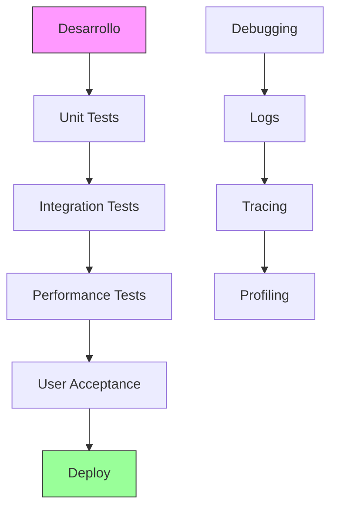

### 20.2 Testing de Patrones

```xml
<!-- Test: Debe coincidir -->
<test>
  <input>HOLA</input>
  <expected>¡Hola! ¿Cómo estás?</expected>
</test>

<!-- Test: No debe coincidir con fallback -->
<test>
  <input>HOLA MUNDO</input>
  <expected>No estoy seguro de entender.</expected>
</test>
```

### 20.3 Testing de Respuestas

```xml
<category>
  <pattern>TEST SRAI</pattern>
  <template>
    <!-- Verificar que SRAI funciona correctamente -->
    <srai>HOLA</srai>
  </template>
</category>
```

### 20.4 Herramientas de Debugging

**Técnicas de debugging:**

1. **Logging**: Registrar cada interacción
2. **Tracing**: Seguir el flujo de matching
3. **Profiling**: Medir tiempos de respuesta
4. **Unit Testing**: Probar categories individuales

### 20.5 Logging y Monitoreo

```xml
<category>
  <pattern>*</pattern>
  <template>
    <thinking>
      Registrar la entrada del usuario para debugging.
    </thinking>
    <system>echo "$(date): USER_INPUT: <star/>" >> aiml.log</system>
    <random>
      <li>Respuesta 1</li>
      <li>Respuesta 2</li>
    </random>
  </template>
</category>
```

### 20.6 Patrón de Test Completo

```xml
<!-- tests/test_saludos.aiml -->
<aiml version="2.0">
  <test-suite name="Saludos">
    <test name="Saludo básico">
      <input>HOLA</input>
      <assert-contains>¡Hola</assert-contains>
    </test>
    
    <test name="Sinónimos">
      <input>BUENOS DÍAS</input>
      <assert-contains>¡Hola</assert-contains>
    </test>
    
    <test name="Con nombre">
      <input>HOLA JUAN</input>
      <assert-contains>Juan</assert-contains>
    </test>
  </test-suite>
</aiml>
```

---

## Capítulo 21: Optimización de Rendimiento


### 21.1 Índice de Patrones

Organizar las categories para búsqueda eficiente:

```xml
<!-- Primero: patrones literales (más rápidos) -->
<category>
  <pattern>HOLA</pattern>
  <template>¡Hola!</template>
</category>

<!-- Después: patrones con wildcards -->
<category>
  <pattern>QUE ES *</pattern>
  <template><star/> es algo.</template>
</category>
```

### 21.2 Cache de Respuestas

```xml
<category>
  <pattern>FACTO *</pattern>
  <template>
    <thinking>
      Verificar si la respuesta está en caché.
      Si no está, calcular y guardar en caché.
    </thinking>
    <condition name="cache-<star/>">
      <li value="">
        <set name="cache-<star/>">Respuesta calculada</set>
        Respuesta calculada
      </li>
      <li><get name="cache-<star/>"/></li>
    </condition>
  </template>
</category>
```

### 21.3 Compilación de Categories

La mayoría de procesadores AIML compilan las categories a código nativo para mayor velocidad.

### 21.4 Manejo de Memoria

**Mejores prácticas:**
- Limitar el número de variables por sesión
- Usar `<learnf>` con moderación
- Limpiar variables no utilizadas
- Implementar TTL para sesiones

### 21.5 Escalabilidad

```xml
<!-- Categorías modulares -->
<aiml version="2.0">
  <!-- Módulo: Saludos -->
  <include file="modules/saludos.aiml"/>
  
  <!-- Módulo: Preguntas -->
  <include file="modules/preguntas.aiml"/>
  
  <!-- Módulo: Fallback -->
  <include file="modules/fallback.aiml"/>
</aiml>
```

---

## Capítulo 22: Organización de Proyectos


### 22.1 Estructura de Directorios

```
aiml_project/
├── main.aiml                 # Archivo principal
├── bootstrap.aiml            # Categories iniciales
├── modules/
│   ├── saludos.aiml          # Módulo de saludos
│   ├── preguntas.aiml        # Módulo de preguntas
│   ├── despedidas.aiml       # Módulo de despedidas
│   └── fallback.aiml         # Módulo de fallback
├── topics/
│   ├── tecnologia.aiml       # Tema: tecnología
│   ├── ciencia.aiml          # Tema: ciencia
│   └── deportes.aiml         # Tema: deportes
├── tests/
│   ├── test_saludos.aiml     # Tests de saludos
│   └── test_preguntas.aiml   # Tests de preguntas
├── data/
│   └── learnf/               # Persistencia de <learnf>
└── docs/
    └── README.md             # Documentación
```

### 22.2 Naming Conventions

```xml
<!-- Prefijos por módulo -->
<category>
  <pattern>SALUDO_HOLA</pattern>
  <template>¡Hola!</template>
</category>

<category>
  <pattern>PREGUNTA_QUE_ES *</pattern>
  <template><star/> es algo.</template>
</category>

<!-- Temas con namespace -->
<topic name="TECNOLOGIA">
  <category>
    <pattern>PYTHON</pattern>
    <template>Python es un lenguaje.</template>
  </category>
</topic>
```

### 22.3 Documentación

```xml
<!-- Documentación en comentarios -->
<!--
  Módulo: Saludos
  Descripción: Maneja todos los saludos del bot
  Autor: Tu Nombre
  Fecha: 2026-01-01
  Version: 1.0
  
  Categories incluidas:
  - HOLA: Saludo básico
  - BUENOS_DIAS: Saludo matutino
  - BUENAS_TARDES: Saludo vespertino
-->
```

### 22.4 Control de Versiones

```bash
# Inicializar repositorio
git init
git add .
git commit -m "Initial AIML project"

# Branches por funcionalidad
git checkout -b feature/new-greetings
git commit -m "Add new greeting patterns"
git checkout main
git merge feature/new-greetings
```

### 22.5 Modularización

```xml
<!-- main.aiml -->
<aiml version="2.0">
  <!-- Cargar módulos en orden -->
  <include file="modules/bootstrap.aiml"/>
  <include file="modules/saludos.aiml"/>
  <include file="modules/preguntas.aiml"/>
  <include file="modules/fallback.aiml"/>
  
  <!-- Cargar temas -->
  <include file="topics/tecnologia.aiml"/>
  <include file="topics/ciencia.aiml"/>
</aiml>
```

### 22.6 Patrón de Proyecto Grande

```xml
<!-- Estructura para proyectos enterprise -->
<aiml version="2.0">
  <!-- Core -->
  <include file="core/bootstrap.aiml"/>
  <include file="core/intentions.aiml"/>
  
  <!-- Features -->
  <include file="features/chat.aiml"/>
  <include file="features/faq.aiml"/>
  <include file="features/support.aiml"/>
  
  <!-- Integrations -->
  <include file="integrations/api.aiml"/>
  <include file="integrations/database.aiml"/>
  
  <!-- Fallback -->
  <include file="fallback/default.aiml"/>
</aiml>
```

---

## Capítulo 23: Mejores Prácticas


### 23.1 Código Limpio en AIML

```xml
<!-- BIEN: Código limpio y organizado -->
<category>
  <pattern>HOLA</pattern>
  <template>
    <thinking>
      Saludo básico del bot.
      Usar respuestas aleatorias para variación.
    </thinking>
    <random>
      <li>¡Hola! ¿Cómo estás?</li>
      <li>¡Buenos días! ¿En qué puedo ayudarte?</li>
    </random>
  </template>
</category>

<!-- MAL: Código desordenado -->
<category><pattern>HOLA</pattern><template><random><li>Hola</li><li>Buenos dias</li></random></template></category>
```

### 23.2 Anti-Patrones a Evitar

```xml
<!-- MAL: Loop infinito de SRAI -->
<category><pattern>A</pattern><template><srai>B</srai></template></category>
<category><pattern>B</pattern><template><srai>A</srai></template></category>

<!-- MAL: Categoría catch-all demasiado amplia -->
<category><pattern>*</pattern><template>No sé.</template></category>

<!-- MAL: Sin fallback específico -->
<category><pattern>QUE ES *</pattern><template>No sé qué es <star/>.</template></category>

<!-- BIEN: Fallback con ayuda -->
<category>
  <pattern>QUE ES *</pattern>
  <template>
    No tengo información sobre <star/>.
    ¿Puedes darme más contexto?
  </template>
</category>
```

### 23.3 Seguridad

```xml
<!-- MAL: Ejecución de código del usuario -->
<category>
  <pattern>EJECUTAR *</pattern>
  <template><system><star/></system></template>
</category>

<!-- BIEN: Comandos predefinidos -->
<category>
  <pattern>FECHA</pattern>
  <template><system>date</system></template>
</category>
```

### 23.4 Mantenibilidad

```xml
<!-- Usar consistencia en naming -->
<category><pattern>GET_USER_NAME</pattern>...</category>
<category><pattern>SET_USER_AGE</pattern>...</category>
<category><pattern>ASK_CONFIRMATION</pattern>...</category>

<!-- Usar comentarios descriptivos -->
<!-- 
  Patrón: Fallback genérico
  Propósito: Manejar entradas no reconocidas
  Última revisión: 2026-01-01
-->
```

### 23.5 Revisión de Código

**Checklist de revisión:**

- [ ] ¿Todos los patrones están en mayúsculas?
- [ ] ¿Los wildcards están correctamente posicionados?
- [ ] ¿No hay loops infinitos de SRAI?
- [ ] ¿Los fallbacks son útiles y no genéricos?
- [ ] ¿Las variables están documentadas?
- [ ] ¿Los tests pasan?
- [ ] ¿El código sigue las convenciones?

---

# Parte VII: Casos de Uso

---

## Capítulo 24: Bot de Atención al Cliente


### 24.1 Arquitectura del Bot

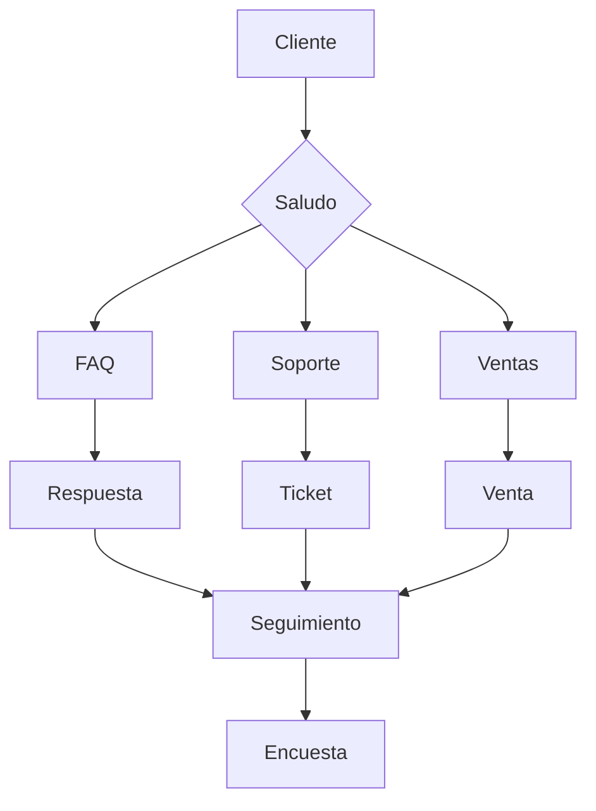

### 24.2 Patrón de FAQ

```xml
<topic name="FAQ">
  <category>
    <pattern>¿QUÉ ES ESTE SERVICIO?</pattern>
    <template>
      Somos una empresa que ofrece soluciones tecnológicas
      para empresas de todos los tamaños.
    </template>
  </category>

  <category>
    <pattern>¿CUÁNTO CUESTA?</pattern>
    <template>
      Tenemos varios planes:
      - Básico: $9.99/mes
      - Profesional: $29.99/mes
      - Enterprise: Personalizado
    </template>
  </category>

  <category>
    <pattern>¿CÓMO ME REGISTRO?</pattern>
    <template>
      Puedes registrarte en nuestra página web.
      ¿Quieres que te guíe paso a paso?
    </template>
  </category>
</topic>
```

### 24.3 Patrón de Quejas

```xml
<category>
  <pattern>TENGO UN PROBLEMA</pattern>
  <template>
    <set name="issue-type">problem</set>
    Lamento escuchar eso. ¿Puedes describir tu problema?
  </template>
</category>

<category>
  <pattern>MI PROBLEMA ES *</pattern>
  <that>¿PUEDES DESCRIBIR TU PROBLEMA?</that>
  <template>
    <set name="issue-desc"><star/></set>
    Entendido. Voy a crear un ticket para ti.
    ¿Cuál es tu nombre?
  </template>
</category>

<category>
  <pattern>MI NOMBRE ES *</pattern>
  <that>¿CUÁL ES TU NOMBRE?</that>
  <template>
    <set name="issue-name"><star/></set>
    Gracias, <star/>. He creado el ticket #1234.
    Te contactaremos pronto.
  </template>
</category>
```

### 24.4 Patrón de Ventas

```xml
<category>
  <pattern>QUIERO COMPRAR</pattern>
  <template>
    ¡Excelente! ¿Qué plan te interesa?
    1. Básico - $9.99/mes
    2. Profesional - $29.99/mes
    3. Enterprise - Personalizado
  </template>
</category>

<category>
  <pattern>PLAN PROFESIONAL</pattern>
  <template>
    Gran elección. El plan Profesional incluye:
    - Soporte prioritario
    - Funciones avanzadas
    - API ilimitada
    ¿Quieres proceder al pago?
  </template>
</category>

<category>
  <pattern>SÍ</pattern>
  <that>¿QUIERES PROCEDER AL PAGO?</that>
  <template>
    Perfecto. Te redirigimos a la pasarela de pago.
    ¡Gracias por tu compra!
  </template>
</category>
```

### 24.5 Ejemplo Completo

```xml
<aiml version="2.0">
  <topic name="CUSTOMER_SERVICE">
    <!-- Saludo -->
    <category>
      <pattern>HOLA</pattern>
      <template>
        ¡Bienvenido al soporte! ¿En qué puedo ayudarte?
        1. Preguntas frecuentes
        2. Soporte técnico
        3. Ventas
      </template>
    </category>

    <!-- Navegación -->
    <category>
      <pattern>UNO</pattern>
      <that>¿EN QUÉ PUEDO AYUDARTE?</that>
      <template><srai>FAQ</srai></template>
    </category>

    <category>
      <pattern>DOS</pattern>
      <that>¿EN QUÉ PUEDO AYUDARTE?</that>
      <template><srai>SOPORTE</srai></template>
    </category>

    <category>
      <pattern>TRES</pattern>
      <that>¿EN QUÉ PUEDO AYUDARTE?</that>
      <template><srai>VENTAS</srai></template>
    </category>
  </topic>
</aiml>
```

---

## Capítulo 25: Bot Educativo


### 25.1 Patrón de Tutoría

```xml
<topic name="TUTORIA">
  <category>
    <pattern>QUIERO APRENDER *</pattern>
  <template>
    <set name="subject"><star/></set>
    ¡Genial! ¿Qué nivel tienes?
    1. Principiante
    2. Intermedio
    3. Avanzado
  </template>
</category>

<category>
  <pattern>PRINCIPIANTE</pattern>
  <that>¿QUÉ NIVEL TIENES?</that>
  <template>
    <set name="level">beginner</set>
    Perfecto. Empecemos con los conceptos básicos de <get name="subject"/>.
  </template>
</category>
```

### 25.2 Patrón de Evaluación

```xml
<category>
  <pattern>QUIERO UNA PRUEBA</pattern>
  <template>
    <set name="quiz-mode">true</set>
    ¡Vamos! Te haré preguntas sobre <get name="subject"/>.
    ¿Estás listo?
  </template>
</category>

<category>
  <pattern>SÍ</pattern>
  <that>¿ESTÁS LISTO?</that>
  <template>
    <set name="quiz-question">1</set>
    Pregunta 1: ¿Qué es una variable?
  </template>
</category>

<category>
  <pattern>*</pattern>
  <that>PREGUNTA 1: ¿QUÉ ES UNA VARIABLE?</that>
  <template>
    <condition name="quiz-answer">
      <li value="correct">¡Correcto! Siguiente pregunta.</li>
      <li value="incorrect">
        Incorrecto. Una variable es un contenedor de datos.
        Siguiente pregunta.
      </li>
    </condition>
  </template>
</category>
```

### 25.3 Patrón de Retroalimentación

```xml
<category>
  <pattern>CÓMO ME FUE</pattern>
  <template>
    <condition name="quiz-score">
      <li value="high">
        ¡Excelente! Tuviste un puntaje alto.
      </li>
      <li value="medium">
        Buen trabajo, pero puedes mejorar.
      </li>
      <li value="low">
        Sigue practicando, ¡mejorarás!
      </li>
    </condition>
  </template>
</category>
```

### 25.4 Ejemplo Completo

```xml
<aiml version="2.0">
  <topic name="EDUCATION">
    <category>
      <pattern>EMPEZAR CURSO</pattern>
      <template>
        <set name="course-active">true</set>
        <set name="lesson">1</set>
        Bienvenido al curso. Lección 1: Introducción.
      </template>
    </category>

    <category>
      <pattern>SIGUIENTE LECCIÓN</pattern>
      <template>
        <set name="lesson">
          <eval>$(lesson) + 1</eval>
        </set>
        Lección <get name="lesson"/>: Continuación del curso.
      </template>
    </category>

    <category>
      <pattern>TERMINAR CURSO</pattern>
      <template>
        <set name="course-active">false</set>
        ¡Felicidades! Has completado el curso.
      </template>
    </category>
  </topic>
</aiml>
```

---

## Capítulo 26: Bot de Salud


### 26.1 Patrón de Triaje

```xml
<topic name="HEALTH">
  <category>
  <pattern>TENGO DOLOR DE *</pattern>
  <template>
    <thinking>
      El usuario reporta dolor. Debo ser cuidadoso
      y recomendar consultar a un profesional.
    </thinking>
    <set name="symptom"><star/></set>
    Lamento escuchar eso. El dolor de <star/> puede tener
    diversas causas. ¿Desde cuándo lo tienes?
  </template>
</category>

<category>
  <pattern>DESDE HACE *</pattern>
  <that>¿DESDE CUÁNDO LO TIENES?</that>
  <template>
    <set name="duration"><star/></set>
    Entendido, son <star/>.
    Te recomiendo consultar a un médico para una evaluación.
    ¿Quieres que te ayude a encontrar uno?
  </template>
</category>
```

### 26.2 Patrón de Recomendaciones

```xml
<category>
  <pattern>TENGO FIEBRE</pattern>
  <template>
    <thinking>
      Fiebre puede ser síntoma de muchas cosas.
      Debo recomendar atención médica.
    </thinking>
    La fiebre es una respuesta del cuerpo.
    Si es alta o persistente, consulta a un médico.
  </template>
</category>

<category>
  <pattern>TENGO TOS</pattern>
  <template>
    La tos puede ser por muchas causas.
    Si dura más de una semana, consulta a un médico.
  </template>
</category>
```

### 26.3 Limitaciones y Advertencias

```xml
<category>
  <pattern>DIAGNÓSTICO *</pattern>
  <template>
    <thinking>
      Nunca dar diagnósticos médicos.
      Siempre recomendar consultar a un profesional.
    </thinking>
    No puedo darte un diagnóstico.
    Por favor, consulta a un médico para una evaluación
    profesional de tu condición.
  </template>
</category>

<category>
  <pattern>MEDICAMENTO *</pattern>
  <template>
    No puedo recomendar medicamentos.
    Consulta a un médico o farmacéutico.
  </template>
</category>
```

### 26.4 Ejemplo Completo

```xml
<aiml version="2.0">
  <topic name="HEALTH_CONSULTATION">
    <category>
      <pattern>EMPEZAR CONSULTA</pattern>
      <template>
        <set name="consultation-step">symptoms</set>
        Cuéntame, ¿qué síntomas tienes?
      </template>
    </category>

    <category>
      <pattern>TENGO *</pattern>
      <that>¿QUÉ SÍNTOMAS TIENES?</that>
      <template>
        <set name="symptoms"><star/></set>
        Entendido. ¿Desde cuándo tienes estos síntomas?
      </template>
    </category>

    <category>
      <pattern>DESDE HACE *</pattern>
      <that>¿DESDE CUÁNDO TIENES ESTOS SÍNTOMAS?</that>
      <template>
        <set name="duration"><star/></set>
        Gracias por la información.
        Te recomiendo consultar a un médico.
        ¿Quieres que te busque uno cercano?
      </template>
    </category>
  </topic>
</aiml>
```

---

## Capítulo 27: Bot Multilingüe


### 27.1 Estructura Multi-Idioma

```xml
<aiml version="2.0">
  <!-- Detección de idioma -->
  <category>
    <pattern>CHANGE LANGUAGE TO ENGLISH</pattern>
    <template>
      <set name="language">EN</set>
      Language changed to English.
    </template>
  </category>

  <category>
    <pattern>CAMBIAR IDIOMA A ESPAÑOL</pattern>
    <template>
      <set name="language">ES</set>
      Idioma cambiado a español.
    </template>
  </category>

  <!-- Respuestas en inglés -->
  <topic name="ENGLISH">
    <category>
      <pattern>HELLO</pattern>
      <template>Hello! How can I help you?</template>
    </category>

    <category>
      <pattern>GOODBYE</pattern>
      <template>Goodbye! Have a nice day!</template>
    </category>
  </topic>

  <!-- Respuestas en español -->
  <topic name="SPANISH">
    <category>
      <pattern>HOLA</pattern>
      <template>¡Hola! ¿Cómo puedo ayudarte?</template>
    </category>

    <category>
      <pattern>ADIOS</pattern>
      <template>¡Adiós! ¡Que tengas un buen día!</template>
    </category>
  </topic>
</aiml>
```

### 27.2 Detección de Idioma

```xml
<category>
  <pattern>WHAT IS YOUR NAME</pattern>
  <template>
    <set name="detected-lang">EN</set>
    My name is Alice.
  </template>
</category>

<category>
  <pattern>CÓMO TE LLAMAS</pattern>
  <template>
    <set name="detected-lang">ES</set>
    Me llamo Alice.
  </template>
</category>

<category>
  <pattern>COMMENT T'APPELLES-TU</pattern>
  <template>
    <set name="detected-lang">FR</set>
    Je m'appelle Alice.
  </template>
</category>
```

### 27.3 Traducción Dinámica

```xml
<category>
  <pattern>TRADUCIR * AL INGLÉS</pattern>
  <template>
    <thinking>
      El usuario quiere traducir algo al inglés.
      Debo usar un diccionario o API de traducción.
    </thinking>
    <system>curl -s "api.translate.com?text=<star/>&target=en"</system>
  </template>
</category>

<category>
  <pattern>TRADUCIR * AL ESPAÑOL</pattern>
  <template>
    <system>curl -s "api.translate.com?text=<star/>&target=es"</system>
  </template>
</category>
```

### 27.4 Ejemplo Completo

```xml
<aiml version="2.0">
  <!-- Bootstrap multi-idioma -->
  <category>
    <pattern>*</pattern>
    <template>
      <thinking>
        Detectar idioma de la entrada y responder en consecuencia.
      </thinking>
      <condition name="language">
        <li value="EN">
          <srai>ENGLISH <star/></srai>
        </li>
        <li value="ES">
          <srai>ESPAÑOL <star/></srai>
        </li>
        <li>
          <set name="language">EN</set>
          I detected you're speaking English.
          How can I help you?
        </li>
      </condition>
    </template>
  </category>
</aiml>
```

---

# Parte VIII: Integración y Despliegue

---

## Capítulo 28: Integración con Python

### 28.1 Uso con python-aiml

```python
import aiml

# Crear motor AIML
kernel = aiml.AIMLKernel()

# Cargar archivos AIML
kernel.learn("startup.aiml")
kernel.respond("load aiml b")

# Procesar mensajes
while True:
    user_input = input("Usuario: ")
    response = kernel.respond(user_input)
    print(f"Bot: {response}")
```

### 28.2 Integración con Flask

```python
from flask import Flask, request, jsonify
import aiml

app = Flask(__name__)
kernel = aiml.AIMLKernel()
kernel.learn("*.aiml")

@app.route("/chat", methods=["POST"])
def chat():
    user_message = request.json.get("message")
    bot_response = kernel.respond(user_message)
    return jsonify({"response": bot_response})

if __name__ == "__main__":
    app.run(debug=True)
```

### 28.3 Integración con Django

```python
# views.py
from django.http import JsonResponse
from django.views.decorators.csrf import csrf_exempt
import json
import aiml

kernel = aiml.AIMLKernel()
kernel.learn("*.aiml")

@csrf_exempt
def chat_view(request):
    if request.method == "POST":
        data = json.loads(request.body)
        user_message = data.get("message")
        bot_response = kernel.respond(user_message)
        return JsonResponse({"response": bot_response})
```

### 28.4 Patrón de Microservicio

```python
# aiml_service.py
from fastapi import FastAPI
from pydantic import BaseModel
import aiml

app = FastAPI()
kernel = aiml.AIMLKernel()
kernel.learn("*.aiml")

class ChatRequest(BaseModel):
    message: str
    session_id: str = "default"

@app.post("/chat")
async def chat(request: ChatRequest):
    response = kernel.respond(request.message)
    return {"response": response}

@app.get("/health")
async def health():
    return {"status": "healthy"}
```

---

## Capítulo 29: Integración con LLMs


### 29.1 AIML como Capa de Control

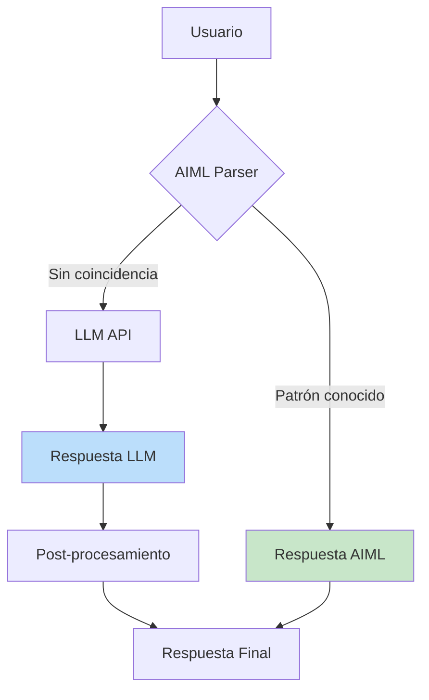

### 29.2 LLM como Fallback

```python
import aiml
import openai

kernel = aiml.AIMLKernel()
kernel.learn("*.aiml")

def get_response(message):
    # Intentar AIML primero
    aiml_response = kernel.respond(message)
    
    # Si AIML no tiene respuesta, usar LLM
    if aiml_response == "":
        response = openai.ChatCompletion.create(
            model="gpt-3.5-turbo",
            messages=[{"role": "user", "content": message}]
        )
        return response.choices[0].message.content
    
    return aiml_response
```

### 29.3 RAG con AIML

```xml
<category>
  <pattern>QUÉ SABES SOBRE *</pattern>
  <template>
    <thinking>
      Buscar en la base de conocimientos sobre <star/>.
      Si no encuentro información, usar LLM.
    </thinking>
    <condition name="kb-<star/>">
      <li value="">
        <system>curl -s "api.llm.com/search?q=<star/>"</system>
      </li>
      <li><get name="kb-<star/>"/></li>
    </condition>
  </template>
</category>
```

### 29.4 Patrón Híbrido

```python
class HybridBot:
    def __init__(self):
        self.aiml_kernel = aiml.AIMLKernel()
        self.aiml_kernel.learn("*.aiml")
        self.llm_client = openai.Client()
    
    def respond(self, message):
        # Paso 1: Intentar AIML
        aiml_response = self.aiml_kernel.respond(message)
        if aiml_response:
            return aiml_response
        
        # Paso 2: Usar LLM
        llm_response = self.llm_client.chat.completions.create(
            model="gpt-3.5-turbo",
            messages=[{"role": "user", "content": message}]
        )
        return llm_response.choices[0].message.content
    
    def learn(self, pattern, response):
        # Aprender nuevo patrón
        self.aiml_kernel.learn(f"""
            <category>
                <pattern>{pattern}</pattern>
                <template>{response}</template>
            </category>
        """)
```

---

## Capítulo 30: Despliegue en Producción


### 30.1 Contenerización

```dockerfile
# Dockerfile
FROM python:3.11-slim

WORKDIR /app

COPY requirements.txt .
RUN pip install -r requirements.txt

COPY . .

EXPOSE 8000

CMD ["python", "app.py"]
```

### 30.2 Balanceo de Carga

```yaml
# docker-compose.yml
version: '3.8'
services:
  aiml-bot:
    build: .
    ports:
      - "8000:8000"
    deploy:
      replicas: 3
      
  nginx:
    image: nginx:latest
    ports:
      - "80:80"
    volumes:
      - ./nginx.conf:/etc/nginx/nginx.conf
    depends_on:
      - aiml-bot
```

### 30.3 Monitoreo

```python
# monitoring.py
import logging
from prometheus_client import Counter, Histogram

REQUEST_COUNT = Counter('aiml_requests', 'Total requests')
RESPONSE_TIME = Histogram('aiml_response_time', 'Response time')

logging.basicConfig(level=logging.INFO)
logger = logging.getLogger(__name__)

def monitor_response(func):
    def wrapper(message):
        REQUEST_COUNT.inc()
        with RESPONSE_TIME.time():
            response = func(message)
            logger.info(f"Message: {message} -> Response: {response}")
            return response
    return wrapper
```

### 30.4 Actualizaciones en Caliente

```python
# hot_reload.py
import watchdog
import aiml

class AIMLReloader(watchdog.events.FileSystemEventHandler):
    def __init__(self, kernel):
        self.kernel = kernel
    
    def on_modified(self, event):
        if event.src_path.endswith('.aiml'):
            logger.info(f"Reloading: {event.src_path}")
            self.kernel.learn(event.src_path)

kernel = aiml.AIMLKernel()
reloader = AIMLReloader(kernel)
observer = watch.observers.Observer()
observer.schedule(reloader, path='./aiml', recursive=True)
observer.start()
```

### 30.5 Backup y Recuperación

```bash
#!/bin/bash
# backup.sh

# Backup de archivos AIML
tar -czf aiml_backup_$(date +%Y%m%d).tar.gz aiml/

# Backup de datos de aprendizaje
cp -r data/learnf/ backups/learnf_$(date +%Y%m%d)/

# Backup de configuración
cp config.* backups/

echo "Backup completado: $(date)"
```

---

# Parte IX: Referencia

---

## Capítulo 31: Referencia Completa de Elementos

### 31.1 Elementos Básicos

| Elemento | Descripción | Ejemplo |
|----------|-------------|---------|
| `<aiml>` | Raíz del documento | `<aiml version="2.0">` |
| `<category>` | Unidad de conocimiento | `<category>...` |
| `<pattern>` | Patrón de coincidencia | `<pattern>HOLA</pattern>` |
| `<template>` | Respuesta | `<template>¡Hola!</template>` |
| `<that>` | Contexto anterior | `<that>RESPUESTA</that>` |
| `<topic>` | Agrupación temática | `<topic name="X">` |

### 31.2 Elementos de Control

| Elemento | Descripción | Ejemplo |
|----------|-------------|---------|
| `<srai>` | Reducción simbólica | `<srai>HOLA</srai>` |
| `<random>` | Respuesta aleatoria | `<random><li>...</li></random>` |
| `<li>` | Elemento de lista | `<li>Opción</li>` |
| `<condition>` | Condición | `<condition name="x">` |
| `<set>` | Establecer variable | `<set name="x">valor</set>` |
| `<get>` | Obtener variable | `<get name="x"/>` |
| `<loop>` | Iterar | `<loop>...</loop>` |

### 31.3 Elementos de Template

| Elemento | Descripción | Ejemplo |
|----------|-------------|---------|
| `<br/>` | Salto de línea | `Línea 1<br/>Línea 2` |
| `<p>` | Párrafo | `<p>Texto</p>` |
| `<a>` | Enlace | `<a href="url">texto</a>` |
| `<image>` | Imagen | `<image>url</image>` |
| `<video>` | Video | `<video>url</video>` |
| `<audio>` | Audio | `<audio>url</audio>` |
| `<table>` | Tabla | `<table>...</table>` |

### 31.4 Elementos de Thinking

| Elemento | Descripción | Ejemplo |
|----------|-------------|---------|
| `<thinking>` | Razonamiento interno | `<thinking>...</thinking>` |
| `<system>` | Comando del sistema | `<system>date</system>` |
| `<date>` | Fecha/hora | `<date format="DD/MM"/>` |
| `<eval>` | Evaluar expresión | `<eval>1+1</eval>` |

### 31.5 Elementos de Aprendizaje

| Elemento | Descripción | Ejemplo |
|----------|-------------|---------|
| `<learn>` | Aprender (temporal) | `<learn>...` |
| `<learnf>` | Aprender (persistente) | `<learnf>...` |
| `<unlearn>` | Olvidar | `<unlearn>...` |

### 31.6 Elementos de Transformación

| Elemento | Descripción | Ejemplo |
|----------|-------------|---------|
| `<person>` | 1ra/2da persona | `<person>texto</person>` |
| `<person2>` | 2da/3ra persona | `<person2>texto</person2>` |
| `<gender>` | Género | `<gender>texto</gender>` |
| `<formal>` | Capitalizar | `<formal>texto</formal>` |
| `<uppercase>` | Mayúsculas | `<uppercase>texto</uppercase>` |
| `<lowercase>` | Minúsculas | `<lowercase>texto</lowercase>` |
| `<sentence>` | Oración | `<sentence>texto</sentence>` |
| `<word>` | Número a palabra | `<word>3</word>` |
| `<explode>` | Explotar | `<explode>hola</explode>` |
| `<implode>` | Implode | `<implode>h o l a</implode>` |

### 31.7 Elementos de Wildcards

| Wildcards | Descripción | Ejemplo |
|-----------|-------------|---------|
| `*` | Una o más palabras | `QUE ES *` |
| `_` | Una o más palabras (mayor prioridad) | `_ ES TU NOMBRE` |
| `**` | Cero o más palabras | `CUENTAME SOBRE **` |
| `^` | Cero o una palabra | `QUE ^ HORA ES` |
| `<star index="N"/>` | Acceso a wildcard N | `<star index="1"/>` |

### 31.8 Elementos de Lista

| Elemento | Descripción | Ejemplo |
|----------|-------------|---------|
| `<list>` | Crear lista | `<list><li>...</li></list>` |
| `<first>` | Primer elemento | `<first>lista</first>` |
| `<rest>` | Resto de la lista | `<rest>lista</rest>` |
| `<size>` | Tamaño de lista | `<size>lista</size>` |
| `<repeat>` | Repetir contenido | `<repeat count="3">x</repeat>` |

### 31.9 Elementos de Historial

| Elemento | Descripción | Ejemplo |
|----------|-------------|---------|
| `<input>` | Historial de input | `<input index="1"/>` |
| `<request>` | Peticiones del usuario | `<request index="1"/>` |
| `<response>` | Respuestas del bot | `<response index="1"/>` |

---

## Capítulo 32: Guía de Solución de Problemas

### 32.1 Errores Comunes

| Error | Causa | Solución |
|-------|-------|----------|
| Loop infinito SRAI | Cadena circular | Verificar cadenas SRAI |
| Template vacío | Sin respuesta | Agregar template con contenido |
| Wildcard no captura | Mal posicionado | Usar `<star index="N"/>` |
| Variable no existe | No inicializada | Usar `<condition>` para verificar |
| Categoría no coincide | Case-sensitive incorrecto | AIML es case-insensitive, verificar |
| Memoria insuficiente | Demasiadas variables | Limpiar variables no usadas |

### 32.2 Debugging Paso a Paso

```xml
<!-- Paso 1: Agregar logging -->
<category>
  <pattern>*</pattern>
  <template>
    <thinking>
      LOG: Input recibido: <star/>
    </thinking>
    <system>echo "INPUT: <star/>" >> debug.log</system>
    <random>
      <li>Respuesta 1</li>
      <li>Respuesta 2</li>
    </random>
  </template>
</category>

<!-- Paso 2: Verificar matching -->
<category>
  <pattern>TEST_PATTERN</pattern>
  <template>
    <thinking>
      LOG: Test pattern ejecutado
    </thinking>
    Test response
  </template>
</category>
```

### 32.3 Rendimiento

**Problemas de rendimiento:**

1. **Demasiadas categories**: Organizar por temas
2. **Wildcards complejos**: Usar patrones literales cuando sea posible
3. **Variables excesivas**: Limpiar después de uso
4. **SRAI en cascada**: Minimizar cadenas largas

### 32.4 Compatibilidad

**Problemas de compatibilidad entre procesadores:**

| Proceso | python-aiml | Program-O | Pandorabots |
|---------|-------------|-----------|-------------|
| `<learn>` | Sí | Sí | Sí |
| `<learnf>` | Sí | Sí | Sí |
| `<system>` | Limitado | Sí | Sí |
| `<eval>` | No | Sí | Sí |
| `<thinking>` | Sí | Sí | Sí |

---

## Capítulo 33: Recursos y Comunidad

### 33.1 Documentación Oficial

- **AIML Foundation**: https://www.aiml.foundation
- **AIML 2.0 Specification**: http://www.aiml.foundation/doc.html
- **Pandorabots**: https://www.pandorabots.com

### 33.2 Comunidad AIML

- **GitHub**: https://github.com/pandorabots/aiml
- **Stack Etiqueta**: https://stackoverflow.com/questions/tagged/aiml
- **Reddit**: https://www.reddit.com/r/aiml/

### 33.3 Herramientas Recomendadas

| Herramienta | Tipo | Descripción |
|-------------|------|-------------|
| **python-aiml** | Librería Python | Procesador AIML para Python |
| **Program-O** | Servidor | Chatbot server con AIML |
| **Pandorabots** | Plataforma | Hosting de chatbots AIML |
| **AIML Generator** | Herramienta | Generador de AIML |
| **Chatbot Studio** | IDE | Editor visual de AIML |

### 33.4 Libros y Recursos

- **"Artificial Intelligence Markup Language"** - Richard Wallace
- **"Building Intelligent Bots"** - Chris Steenson
- **"AIML Tutorial"** - Pandorabots Documentation

---

# Apéndice A: Ejemplo Completo de Bot

```xml
<?xml version="1.0" encoding="UTF-8"?>
<aiml version="2.0">
  
  <!-- ============================================ -->
  <!-- BOOTSTRAP - Configuración inicial            -->
  <!-- ============================================ -->
  
  <category>
    <pattern>LOAD AIML B</pattern>
    <template>
      <set name="bot-name">Alice</set>
      <set name="bot-version">2.0</set>
      <set name="language">ES</set>
      Bot cargado correctamente.
    </template>
  </category>

  <!-- ============================================ -->
  <!-- SALUDOS                                      -->
  <!-- ============================================ -->
  
  <topic name="SALUDOS">
    <category>
      <pattern>HOLA</pattern>
      <template>
        <random>
          <li>¡Hola! ¿Cómo estás?</li>
          <li>¡Buenos días! ¿En qué puedo ayudarte?</li>
          <li>¡Hey! Qué gusto verte.</li>
        </random>
      </template>
    </category>

    <category>
      <pattern>Buenos dias</pattern>
      <template><srai>HOLA</srai></template>
    </category>

    <category>
      <pattern>Buenas tardes</pattern>
      <template><srai>HOLA</srai></template>
    </category>

    <category>
      <pattern>Buenas noches</pattern>
      <template><srai>HOLA</srai></template>
    </category>
  </topic>

  <!-- ============================================ -->
  <!-- DESPEDIDAS                                   -->
  <!-- ============================================ -->
  
  <topic name="DESPEDIDAS">
    <category>
      <pattern>ADIOS</pattern>
      <template>
        <random>
          <li>¡Hasta luego!</li>
          <li>¡Nos vemos!</li>
          <li>¡Que tengas un buen día!</li>
        </random>
      </template>
    </category>

    <category>
      <pattern>HASTA LUEGO</pattern>
      <template><srai>ADIOS</srai></template>
    </category>

    <category>
      <pattern>CHAO</pattern>
      <template><srai>ADIOS</srai></template>
    </category>
  </topic>

  <!-- ============================================ -->
  <!-- INFORMACIÓN DEL BOT                          -->
  <!-- ============================================ -->
  
  <topic name="INFO_BOT">
    <category>
      <pattern>¿QUIÉN ERES?</pattern>
      <template>
        Soy <bot name="name"/>, versión <bot name="version"/>.
        Soy un asistente virtual basado en AIML 2.0.
      </template>
    </category>

    <category>
      <pattern>¿CÓMO TE LLAMAS?</pattern>
      <template>Mi nombre es <bot name="name"/>.</template>
    </category>

    <category>
      <pattern>¿QUÉ PUEDES HACER?</pattern>
      <template>
        Puedo:
        1. Responder preguntas
        2. Mantener conversaciones
        3. Aprender nuevas cosas
        4. Divertirte
      </template>
    </category>
  </topic>

  <!-- ============================================ -->
  <!-- MEMORIA                                       -->
  <!-- ============================================ -->
  
  <topic name="MEMORIA">
    <category>
      <pattern>MI NOMBRE ES *</pattern>
      <template>
        <set name="user-name"><star/></set>
        Mucho gusto, <get name="user-name"/>!
      </template>
    </category>

    <category>
      <pattern>CUÁL ES MI NOMBRE</pattern>
      <template>
        <condition name="user-name">
          <li value="">No sé tu nombre todavía.</li>
          <li>Tu nombre es <get name="user-name"/>.</li>
        </condition>
      </template>
    </category>

    <category>
      <pattern>MI COLOR FAVORITO ES *</pattern>
      <template>
        <set name="user-color"><star/></set>
        ¡Genial! Tu color favorito es <star/>.
      </template>
    </category>

    <category>
      <pattern>CUÁL ES MI COLOR FAVORITO</pattern>
      <template>
        <condition name="user-color">
          <li value="">No sé tu color favorito.</li>
          <li>Tu color favorito es <get name="user-color"/>.</li>
        </condition>
      </template>
    </category>
  </topic>

  <!-- ============================================ -->
  <!-- PREGUNTAS GENERALES                           -->
  <!-- ============================================ -->
  
  <topic name="PREGUNTAS">
    <category>
      <pattern>QUÉ ES *</pattern>
      <template>
        <star/> es algo interesante sobre lo que puedo hablar.
      </template>
    </category>

    <category>
      <pattern>CUÉNTAME SOBRE *</pattern>
      <template>
        <set name="last-topic"><star/></set>
        <star/> es un tema fascinante.
      </template>
    </category>

    <category>
      <pattern>CUÉNTAME MÁS</pattern>
      <template>
        <condition name="last-topic">
          <li value="">¿Sobre qué tema quieres que hable?</li>
          <li>¿Qué más quieres saber sobre <get name="last-topic"/>?</li>
        </condition>
      </template>
    </category>
  </topic>

  <!-- ============================================ -->
  <!-- RESPUESTAS ALEATORIAS                         -->
  <!-- ============================================ -->
  
  <topic name="ALEATORIO">
    <category>
      <pattern>CUENTA UN CHISTE</pattern>
      <template>
        <random>
          <li>¿Por qué el libro de matemáticas estaba triste? Porque tenía muchos problemas.</li>
          <li>¿Qué le dijo un techo a otro techo? Techo de techo.</li>
          <li>¿Por qué el café se fue al psicólogo? Porque se sentía molido.</li>
        </random>
      </template>
    </category>

    <category>
      <pattern>CUÉNTAME ALGO</pattern>
      <template>
        <random>
          <li>¿Sabías que el agua cubre el 71% de la Tierra?</li>
          <li>¿Sabías que los pulpos tienen tres corazones?</li>
          <li>¿Sabías que la luz viaja a 299,792 km/s?</li>
          <li>¿Sabías que las abejas pueden reconocer rostros humanos?</li>
        </random>
      </template>
    </category>
  </topic>

  <!-- ============================================ -->
  <!-- FALLBACK                                      -->
  <!-- ============================================ -->
  
  <category>
    <pattern>*</pattern>
    <template>
      <thinking>
        No entendí la entrada del usuario.
        Ofrecer ayuda específica.
      </thinking>
      <random>
        <li>No estoy seguro de entender. ¿Puedes reformular?</li>
        <li>Lo siento, no comprendo. ¿Puedes explicarme?</li>
        <li>¿Podrías decirlo de otra manera?</li>
      </random>
    </template>
  </category>

</aiml>
```

---

# Apéndice B: Patrones de Diseño Avanzados

## B.1 Patrón de Estado

```xml
<category>
  <pattern>SIGUIENTE</pattern>
  <template>
    <condition name="state">
      <li value="step1">
        <set name="state">step2</set>
        Paso 2: Describe tu problema.
      </li>
      <li value="step2">
        <set name="state">step3</set>
        Paso 3: Elige una categoría.
      </li>
      <li value="step3">
        <set name="state">step1</set>
        Tu caso ha sido registrado.
      </li>
      <li>
        <set name="state">step1</set>
        Paso 1: Dime tu nombre.
      </li>
    </condition>
  </template>
</category>
```

## B.2 Patrón de Cache

```xml
<category>
  <pattern>CALCULAR *</pattern>
  <template>
    <condition name="cache-<star/>">
      <li value="">
        <set name="cache-<star/>">Resultado calculado</set>
        Resultado calculado
      </li>
      <li><get name="cache-<star/>"/></li>
    </condition>
  </template>
</category>
```

## B.3 Patrón de Menú

```xml
<category>
  <pattern>MENÚ</pattern>
  <template>
    <set name="menu">main</set>
    1. Información
    2. Soporte
    3. Ventas
    Elige una opción.
  </template>
</category>

<category>
  <pattern>UNO</pattern>
  <that>ELIGE UNA OPCIÓN</that>
  <template>
    <set name="menu">info</set>
    1. Empresa
    2. Productos
    3. Precios
  </template>
</category>

<category>
  <pattern>DOS</pattern>
  <that>ELIGE UNA OPCIÓN</that>
  <template>
    <set name="menu">support</set>
    1. FAQ
    2. Contacto
    3. Ticket
  </template>
</category>
```

## B.4 Patrón de Confirmación

```xml
<category>
  <pattern>ELIMINAR *</pattern>
  <template>
    <set name="pending-delete"><star/></set>
    ¿Estás seguro de que quieres eliminar <star/>?
  </template>
</category>

<category>
  <pattern>SÍ</pattern>
  <that>¿ESTÁS SEGURO DE QUE QUIERES ELIMINAR *?</that>
  <template>
    <set name="pending-delete">""</set>
    Eliminado correctamente.
  </template>
</category>

<category>
  <pattern>NO</pattern>
  <that>¿ESTÁS SEGURO DE QUE QUIERES ELIMINAR *?</that>
  <template>
    <set name="pending-delete">""</set>
    Operación cancelada.
  </template>
</category>
```

## B.5 Patrón de Idioma

```xml
<category>
  <pattern>CAMBIAR A INGLÉS</pattern>
  <template>
    <set name="lang">EN</set>
    Language changed to English.
  </template>
</category>

<category>
  <pattern>CAMBIAR A ESPAÑOL</pattern>
  <template>
    <set name="lang">ES</set>
    Idioma cambiado a español.
  </template>
</category>

<category>
  <pattern>*</pattern>
  <template>
    <condition name="lang">
      <li value="EN">
        <srai>ENGLISH <star/></srai>
      </li>
      <li>
        <srai>ESPAÑOL <star/></srai>
      </li>
    </condition>
  </template>
</category>
```

---

# Apéndice C: Soluciones a Problemas Comunes

## C.1 Loop Infinito de SRAI

**Problema:**
```xml
<category><pattern>A</pattern><template><srai>B</srai></template></category>
<category><pattern>B</pattern><template><srai>A</srai></template></category>
```

**Solución:** Usar un contador de iteraciones:
```xml
<category>
  <pattern>A</pattern>
  <template>
    <condition name="srai-count">
      <li value="10">
        <set name="srai-count">0</set>
        Demasiadas iteraciones.
      </li>
      <li>
        <set name="srai-count">
          <eval>$(srai-count) + 1</eval>
        </set>
        <srai>B</srai>
      </li>
    </condition>
  </template>
</category>
```

## C.2 Variable No Existe

**Problema:** `<get name="x"/>` retorna vacío

**Solución:** Verificar antes de usar:
```xml
<category>
  <pattern>USAR VARIABLE</pattern>
  <template>
    <condition name="x">
      <li value="">Variable no configurada.</li>
      <li>Valor: <get name="x"/></li>
    </condition>
  </template>
</category>
```

## C.3 Wildcard No Captura

**Problema:** `<star/>` no captura lo esperado

**Solución:** Usar `<star index="N"/>` explícito:
```xml
<category>
  <pattern>MI * ES *</pattern>
  <template>
    <star index="1"/> es <star index="2"/>.
  </template>
</category>
```

## C.4 Template Devuelve Vacío

**Problema:** La category coincide pero no retorna respuesta

**Solución:** Verificar que el template tenga contenido:
```xml
<!-- MAL -->
<category>
  <pattern>HOLA</pattern>
  <template></template>
</category>

<!-- BIEN -->
<category>
  <pattern>HOLA</pattern>
  <template>¡Hola!</template>
</category>
```

---

# Apéndice D: Resumen de Elementos AIML 2.0

## D.1 Elementos Básicos

| Elemento | Descripción |
|----------|-------------|
| `<aiml>` | Raíz del documento AIML |
| `<category>` | Unidad fundamental: pattern + template |
| `<pattern>` | Patrón de coincidencia con entrada |
| `<template>` | Respuesta al patrón coincidente |
| `<that>` | Contexto de respuesta anterior del bot |
| `<topic>` | Agrupación de categories por tema |
| `<star>` | Captura de wildcard |
| `<bot>` | Propiedades del bot |
| `<person>` | Conversión 1ra/2da persona |
| `<person2>` | Conversión 2da/3ra persona |
| `<gender>` | Intercambio de género |

## D.2 Elementos de Control

| Elemento | Descripción |
|----------|-------------|
| `<srai>` | Reducción simbólica |
| `<random>` | Selección aleatoria de respuesta |
| `<li>` | Elemento en lista |
| `<condition>` | Respuesta condicional |
| `<set>` | Establecer variable |
| `<get>` | Obtener valor de variable |
| `<loop>` | Iterar sobre elementos |

## D.3 Wildcards

| Wildcard | Descripción |
|----------|-------------|
| `*` | Coincide una o más palabras |
| `_` | Coincide una o más palabras (mayor prioridad) |
| `**` | Coincide cero o más palabras (AIML 2.0) |
| `^` | Coincide cero o una palabra (AIML 2.0) |
| `<star index="N"/>` | Acceso al N-ésimo wildcard |

## D.4 Elementos de Template

| Elemento | Descripción |
|----------|-------------|
| `<br/>` | Salto de línea |
| `<p>` | Párrafo |
| `<a>` | Hipervínculo |
| `<image>` | Imagen |
| `<video>` | Video |
| `<audio>` | Audio |
| `<embed>` | Contenido embebido |
| `<svg>` | Imagen SVG |
| `<table>` | Tabla HTML |
| `<tr>` | Fila de tabla |
| `<td>` | Celda de tabla |

## D.5 Elementos de Thinking (AIML 2.0)

| Elemento | Descripción |
|----------|-------------|
| `<thinking>` | Razonamiento interno (no visible) |
| `<system>` | Operaciones del sistema |
| `<date>` | Fecha y hora actual |
| `<eval>` | Ejecución de comandos |
| `<explode>` | Separar caracteres con espacios |
| `<implode>` | Unir palabras separadas |
| `<formal>` | Capitalizar cada palabra |
| `<uppercase>` | Convertir a mayúsculas |
| `<lowercase>` | Convertir a minúsculas |
| `<sentence>` | Capitalizar primera letra |
| `<word>` | Conversión número a palabra |

## D.6 Elementos de Aprendizaje (AIML 2.0)

| Elemento | Descripción |
|----------|-------------|
| `<learn>` | Aprender durante conversación (temporal) |
| `<learnf>` | Aprender y persistir en disco |
| `<unlearn>` | Olvidar aprendizaje |

---

# Apéndice E: Glossario

| Término | Definición |
|---------|------------|
| **AIML** | Artificial Intelligence Markup Language |
| **ALICE** | Artificial Linguistic Internet Computer Entity |
| **Bot** | Programa de conversación |
| **Category** | Unidad fundamental de AIML |
| **Chatbot** | Robot de conversación |
| **Fallback** | Respuesta por defecto cuando no hay coincidencia |
| **LLM** | Large Language Model (Modelo de Lenguaje Grande) |
| **Loebner Prize** | Competencia anual de chatbots |
| **Matching** | Proceso de coincidencia de patrones |
| **Pattern** | Patrón de coincidencia |
| **RAG** | Retrieval Augmented Generation |
| **SRAI** | Symbolic Reduction |
| **Template** | Plantilla de respuesta |
| **Wildcard** | Comodín para coincidencia flexible |

---

# Apéndice F: Recursos

## F.1 Enlaces Útiles

- **AIML Foundation**: https://www.aiml.foundation
- **AIML 2.0 Specification**: http://www.aiml.foundation/doc.html
- **Pandorabots**: https://www.pandorabots.com
- **GitHub AIML**: https://github.com/pandorabots/aiml
- **python-aiml**: https://github.com/pandorabots/python-aiml

## F.2 Herramientas

| Herramienta | Tipo | URL |
|-------------|------|-----|
| python-aiml | Librería Python | https://github.com/pandorabots/python-aiml |
| Program-O | Servidor | http://www.program-o.com |
| Pandorabots | Plataforma | https://www.pandorabots.com |
| AIML Generator | Herramienta | https://www.aimlgenerator.com |

## F.3 Libros Recomendados

- **"Artificial Intelligence Markup Language"** - Richard Wallace
- **"Building Intelligent Bots"** - Chris Steenson
- **"AIML Tutorial"** - Pandorabots Documentation

---

# Índice Alfabético

## A
- `<aiml>` - 3.1
- Aprendizaje dinámico - 13.0
- Archivos múltiples - 3.8

## B
- `<bot>` - 10.2
- Bootstrap - Apéndice A

## C
- `<category>` - 3.2
- `<condition>` - 6.0
- Comentarios - 3.7
- Compatibilidad - 32.4

## D
- `<date>` - 15.2
- Debugging - 20.0
- Despedidas - 17.2

## E
- `<eval>` - 15.3
- `<explode>` - 14.8

## F
- `<formal>` - 14.4
- Formateo - 16.0
- Fallback - 17.3

## G
- `<gender>` - 14.3
- `<get>` - 10.0

## H
- HTML en AIML - 16.1

## I
- `<implode>` - 14.8
- `<input>` - 12.1

## L
- `<learn>` - 13.1
- `<learnf>` - 13.2
- `<li>` - 7.0
- `<list>` - 11.1
- Loops infinitos - 5.5
- `<loop>` - 11.6

## M
- Matching - 4.0
- Memoria - 19.0
- Multi-turno - 17.6

## O
- Optimización - 21.0

## P
- `<pattern>` - 3.3
- `<person>` - 14.1
- `<person2>` - 14.2
- Prioridad - 4.8

## R
- `<random>` - 7.0
- `<repeat>` - 11.5
- `<request>` - 12.2
- `<response>` - 12.3
- `<rest>` - 11.3

## S
- `<sentence>` - 14.6
- `<set>` - 10.0
- `<size>` - 11.4
- `<srai>` - 5.0
- `<star>` - 4.0
- `<system>` - 15.4
- Seguridad - 23.3
- Sentimientos - 18.2

## T
- `<table>` - 16.6
- `<template>` - 3.4
- `<thinking>` - 15.1
- `<that>` - 8.0
- `<topic>` - 9.0
- Testing - 20.0
- Transformaciones - 14.0

## U
- `<unlearn>` - 13.3
- `<uppercase>` - 14.5

## V
- Variables - 10.0

## W
- Wildcards - 4.0
- `<word>` - 14.7

---

**Fin del documento**

*La Biblia del AIML 2.1 - Guía Completa del Estándar*
*Versión 2.1 - Última actualización: 2026-08-06*